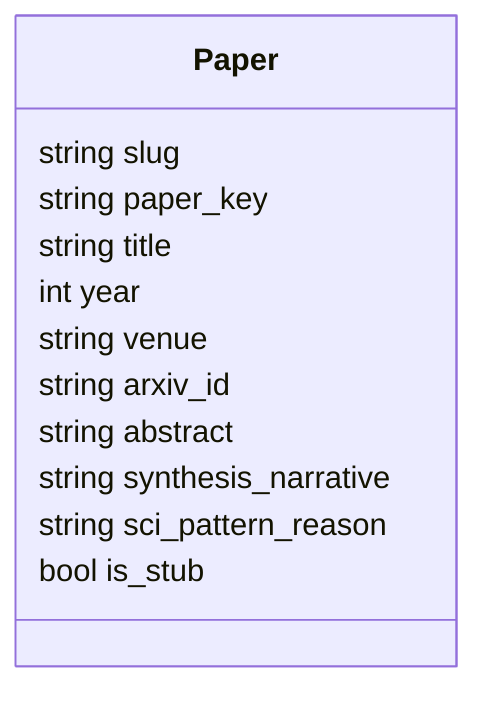
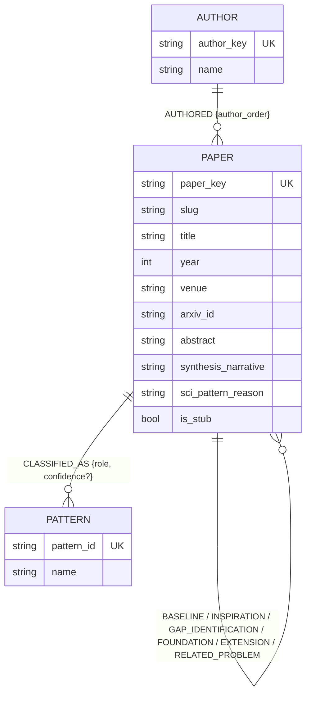
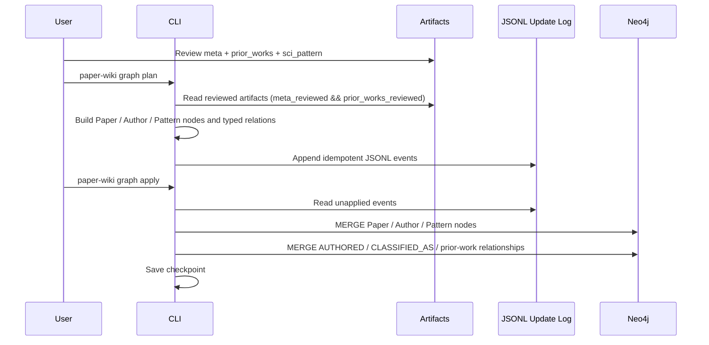

# Neo4j 科学发现图谱需求与技术方案

> 状态：v2 重构方案（需求 + 技术设计，尚未改代码）| 创建：2026-07-03 | 本次更新：2026-07-15 | 适用范围：Layer 2 科学发现图谱

---

## 0. 变更说明：为什么现在重构

v1（2026-07-03）只定义了一种节点 `Paper`，作者和科学范式都是 Paper 节点上的 list/string 属性。触发这次重构的是三个已经发生的上游变化：

1. **`graph_state/` 快照已被删除**：`graph_state/papers.json` 和 `graph_state/prior_work_relations.json` 已经从仓库里移除（`git status` 可见），但 `graph_updates/graph_updates.jsonl` 和 `graph_updates/checkpoint.json` 还留着——这是一份指向已经不存在的快照、且 schema 即将变化的孤立日志。不管这次重构的具体设计是什么，这份旧日志都需要作废重来（详见第 13 节）。
2. **Prior Works 现在会自动做 arXiv 回填**：ingest 流程新增了 `backfill_prior_works_from_arxiv`（`src/paper_wiki/ingestion/prior_works_backfill.py`），在生成 `prior_works.json` 时，对每条缺 `arxiv_id` 的先前工作用标题去 arXiv 搜索，标题相似度达标就回填 `title`/`authors`/`year`/`arxiv_id`。这直接改善了两件事：
   - `paper_key` 现在能更频繁地命中 `arxiv:{id}` 这一档（原来大多数 stub 论文只能退化到 `title_year`/`title hash`，标题格式的微小差异就会产生重复节点；同一篇被多篇论文引用的先前工作，现在更可能正确合并成同一个 Paper 节点）。
   - `authors` 字段的质量出现了分层：命中回填的条目是 arXiv 返回的完整作者列表（逗号分隔的规范姓名），没命中的条目仍然是 LLM 从引用文本里抽取的、类似 `"Smith et al."` 的截断字符串。这次把 Author 提升为节点后，这个质量差异必须在抽取规则里显式处理（见 5.2 节）。
3. **Review 状态已经拆分**：`PaperAssetMeta`（`src/paper_wiki/assets/models.py`）把原来单一的 `reviewed` 拆成了 `meta_reviewed` 和 `prior_works_reviewed` 两个独立开关（旧数据有迁移兼容逻辑）。但 `GraphPlanner.plan_slug`（`src/paper_wiki/graph/planner.py:42`）目前入库门槛检查的还是 `bundle.manifest.paper.reviewed`，需要跟着更新（见第 10 节）。

在此基础上，用户提出了本次重构的建模需求：把 **Author、Pattern 提升为一等节点**，而不是 Paper 上的属性。

---

## 1. 现状梳理（重构前实际状态）

先澄清一个容易误判的点：**Neo4j 写入这一层其实已经完整实现**，不是只停在"规划"阶段。

| 模块                 | 文件                                        | 现状                                                                                                                                                                                                    |
| -------------------- | ------------------------------------------- | ------------------------------------------------------------------------------------------------------------------------------------------------------------------------------------------------------- |
| 节点/关系数据模型    | `src/paper_wiki/graph/models.py`          | 只有`PaperNode` 一种节点；`PriorWorkRelation` 一种关系，无属性                                                                                                                                      |
| Artifact 读取        | `src/paper_wiki/graph/artifact_reader.py` | 读`manifest.json` + `prior_works.json` + `sci_pattern.json`，Pydantic 校验，算 `artifact_hash`（这部分和当前 ingest 产物完全对齐，不需要改）                                                    |
| 快照 diff + 事件生成 | `src/paper_wiki/graph/planner.py`         | `plan_slug()` 读 artifact、和本地快照 diff、写快照、追加 JSONL 事件；入库门槛判断的是 `manifest.paper.reviewed`（已过时，见第 10 节）                                                               |
| 本地状态存储         | `src/paper_wiki/graph/state_store.py`     | 快照读写、JSONL 追加、checkpoint 管理——本身没问题，但依赖的快照文件已被删除                                                                                                                           |
| Neo4j 写入           | `src/paper_wiki/graph/neo4j_store.py`     | **已完整实现**：真实连接 Aura（`.env` 里的 `NEO4J_*` 已配置），`ensure_schema()` 建约束/索引，`_upsert_paper`/`_upsert_relation`/`_delete_relation` 用 `MERGE`/`DELETE` 写 Cypher |
| CLI                  | `src/paper_wiki/cli/main.py`              | `paper-wiki graph plan` 和 `paper-wiki graph apply` 均已实现且能真的连 Neo4j                                                                                                                        |
| 测试                 | `tests/unit/test_graph.py`                | 覆盖`ArtifactReader` 和 `GraphPlanner` 的事件生成；不覆盖 `neo4j_store.py`（合理，需要真实/mock Neo4j）                                                                                           |

也就是说，这次重构的工作量主要在**节点/关系模型、抽取规则、事件类型**，`plan`/`apply` 两阶段的整体架构、JSONL 增量事件、CLI 命令外壳都可以直接复用，不需要推翻。

---

## 2. 目标（不变）

科学发现图谱用于表达论文之间的思想传承关系，核心问题是：

- 一篇论文建立在哪些先前工作之上？
- 一篇先前工作影响了哪些后续论文？
- 某类科学创新范式下有哪些论文，彼此如何演化？
- 某位作者的论文横跨了哪些科学创新范式？
- 两篇论文之间是否存在可解释的研究脉络路径？

第四个问题是本次重构新增的能力——只有把 Author 提升为节点才能直接查询，v1 的属性式设计做不到。

---

## 3. 建模原则（更新）

三种节点：`Paper`、`Author`、`Pattern`。三类关系：

- `Paper` — 先前工作关系 — `Paper`（沿用 v1 的 6 类关系类型，不变）
- `Author` — 署名关系 — `Paper`
- `Paper` — 范式分类关系 — `Pattern`

**属性最小化原则（收窄范围，2026-07-16 更新）**：图里只保留身份标识（用于 MERGE 去重）和用于结构化过滤/遍历的字段，这一条对关系属性依然成立——`relationship_sentence`（先前工作关系的一句话说明）这类自由文本只留在 `artifacts/{slug}/*.json` 里作为唯一来源，不在关系边上重复存一份。

但 `Paper` 节点是例外：`abstract`（论文摘要，如有）、`synthesis_narrative`（前作综合叙述）、`sci_pattern_reason`（范式分类理由）这三个字段**直接存在 `Paper` 节点上**。原因是 Paper 节点本身就是图谱里"当前论文"的唯一入口——查询者从图里定位到一篇论文后，往往就地就想看到这些内容，而不必再跳去读 artifacts 文件；这几个字段体量也可控（几句话到一段话），不是整篇论文正文那种量级，直接挂在节点上不会让图谱膨胀成内容仓库。这条例外只适用于 Paper 节点自身的这三个字段，不代表放弃属性最小化原则——关系边、Author/Pattern 节点仍然只保留身份标识和结构化字段。

Paper 的 stub 机制保留：先前工作未被正式 ingest 前，仍以 `Paper` 节点存在（`is_stub=true`），后续被 ingest 后原地补全（`is_stub=false`）。Author / Pattern 不需要 stub 概念——它们本身就是从属信息，不存在"先只知道名字，以后再补全"的中间态。

---

## 4. 节点定义

### 4.1 Paper 节点（收窄）



| 属性                    | 类型   | 说明                                                    |
| ----------------------- | ------ | ------------------------------------------------------- |
| `paper_key`            | string | 稳定去重键（MERGE 键），规则不变，见第 8.1 节          |
| `slug`                 | string | 已完整收录论文的目录名；stub 节点为空字符串            |
| `title`                | string | 论文标题                                                |
| `year`                 | int    | 发表年份，可空                                          |
| `venue`                | string | 会议或期刊                                              |
| `arxiv_id`             | string | arXiv ID，如有                                          |
| `abstract`             | string | 论文摘要，如有；stub 节点通常为空字符串                |
| `synthesis_narrative`  | string | 前作综合叙述，来自 `prior_works.json`；stub 节点为空 |
| `sci_pattern_reason`   | string | 范式分类理由，来自 `sci_pattern.json`；stub 节点为空 |
| `is_stub`              | bool   | 是否仅由 prior work 记录创建的占位节点                |

相比 v1 去掉了 `authors`、`primary_pattern_id/name`、`secondary_pattern_ids/names`、`added_date` 四个字段——前三个分别迁移到 Author/Pattern 节点和对应关系，`added_date` 是 wiki 应用自己的入库时间，不是图谱结构查询需要的字段，图谱不必复制一份。`synthesis_narrative`/`sci_pattern_reason` 保留在 Paper 节点上（见第 3 节的例外说明），并新增 `abstract`。

### 4.2 Author 节点

| 属性           | 类型   | 说明                                |
| -------------- | ------ | ----------------------------------- |
| `author_key` | string | 归一化姓名（MERGE 键），见第 8.2 节 |
| `name`       | string | 展示用原始姓名                      |

只有两个字段。作者身份消歧（ORCID、机构、缩写名归并）不在本次范围内，见第 12 节的已知限制。

### 4.3 Pattern 节点

| 属性           | 类型   | 说明                                                                                               |
| -------------- | ------ | -------------------------------------------------------------------------------------------------- |
| `pattern_id` | string | `P01`~`P15`（MERGE 键）                                                                        |
| `name`       | string | 英文名称，来自`prompts/pattern_taxonomy.json`，例如 `P05` → `Data & Evaluation Engineering` |

Pattern 是一个封闭的 15 值集合。不单独做 seed 脚本，跟随论文分类事件懒创建（第一次遇到某个 `pattern_id` 时 `MERGE`），实现更简单且同样幂等。

---

## 5. 关系定义

### 5.1 Paper → Paper（先前工作关系，沿用 v1，不变）

方向：当前论文 → 先前工作。`prior_works.role` 直接映射为 Neo4j 关系类型：

| `prior_works.role`   | Neo4j 关系类型         | 语义                                                   |
| ---------------------- | ---------------------- | ------------------------------------------------------ |
| `Baseline`           | `BASELINE`           | 先前工作是当前论文主要改进或对比的核心系统             |
| `Inspiration`        | `INSPIRATION`        | 先前工作的具体思想直接激发了当前论文的关键创新         |
| `Gap Identification` | `GAP_IDENTIFICATION` | 先前工作的局限或失败推动了当前研究方向                 |
| `Foundation`         | `FOUNDATION`         | 先前工作引入了当前论文所用的核心问题定义、数据集或框架 |
| `Extension`          | `EXTENSION`          | 当前论文直接扩展、修改或泛化了先前工作的方法           |
| `Related Problem`    | `RELATED_PROBLEM`    | 先前工作解决了紧密相关问题，其思路启发了当前工作       |

无属性（关系类型本身即语义），Cypher 查询方式不变。

### 5.2 Author → Paper（署名关系）

- 关系类型：`AUTHORED`
- 方向：`(:Author)-[:AUTHORED]->(:Paper)`
- 属性：`author_order`（int，0-based，对应原始 authors 列表里的顺序，可直接用于区分第一作者/通讯作者位置）

**抽取规则**（这是本次重构里唯一需要按数据质量分支处理的地方）：

- **主论文**（`is_stub=false`）：`authors` 来自 `manifest.json` 的 `PaperAssetMeta.authors`，人工 review 过的干净列表，逐个生成 Author 节点和 `AUTHORED` 边，`author_order` 就是列表下标，无歧义。
- **先前工作 stub**：`prior_works.json` 的 `authors` 是一个逗号拼接字符串，质量不齐——命中 arXiv 回填的条目是完整规范姓名列表；没命中的条目通常是 LLM 抽取的截断形式（如 `"Smith et al."`）。只有当这个字符串**不以 `et al.` 结尾（大小写不敏感）且非空**时才拆分建 Author 节点/边；否则跳过，不为这条先前工作创建任何 Author 节点，避免把残缺片段当成作者写进图里。这个判断规则和第 0 节提到的 arXiv 回填质量分层是直接对应的。

### 5.3 Paper → Pattern（范式分类关系）

- 关系类型：`CLASSIFIED_AS`
- 方向：`(:Paper)-[:CLASSIFIED_AS]->(:Pattern)`
- 属性：
  - `role`：`"primary"` 或 `"secondary"`
  - `confidence`：**只在 `role="primary"` 时携带**。`sci_pattern.json` 的 `confidence` 字段描述的是"对主范式判断的置信度"，不是逐个次要范式单独打分，如果同样贴到 secondary 边上会造成误导，所以 secondary 边不带这个属性（同一关系类型的边允许属性稀疏，这在属性图里是常见且诚实的做法）。

一篇论文恒好有一条 `role=primary` 的边，0 条或多条 `role=secondary` 的边。

---

## 6. 图谱结构总览



---

## 7. 增量更新设计（架构不变，事件类型扩充）

三阶段流程不变：`reviewed artifacts -> graph_state snapshot -> graph_updates.jsonl -> Neo4j MERGE`。

### 7.1 为什么用 JSONL（不变）

- 每行独立事件，便于追加写入、进 Git、失败后从 checkpoint 续传
- `plan` 和 `apply` 解耦，便于测试和人工审查

### 7.2 事件类型（新增 Author/Pattern 相关事件）

沿用现有 4 类事件（`upsert_paper` 收窄 payload、`upsert_prior_work_relation`、`delete_prior_work_relation` 均不变），新增：

| 事件                              | 说明                                                                                                     |
| --------------------------------- | -------------------------------------------------------------------------------------------------------- |
| `upsert_author`                 | payload 为`{name}`，`author_key` 作为 MERGE 键                                                       |
| `upsert_pattern`                | payload 为`{name}`，`pattern_id` 作为 MERGE 键；实际几乎只在第一次遇到某个 `pattern_id` 时触发一次 |
| `upsert_authorship`             | Author→Paper 边，payload 为`{author_order}`                                                           |
| `upsert_pattern_classification` | Paper→Pattern 边，payload 为`{role, confidence?}`                                                     |
| `delete_authorship`             | 人工修订作者列表后，撤销旧的`AUTHORED` 边；机制与现有 `delete_prior_work_relation` 完全一致          |
| `delete_pattern_classification` | 人工修订范式分类后，撤销旧的`CLASSIFIED_AS` 边；机制同上                                               |

新增事件复用现有的 upsert-diff-idempotent 模式，不引入新机制。

### 7.3 事件幂等性（不变，`event_id` 规则扩充）

```text
upsert_author:{author_key}
upsert_pattern:{pattern_id}
upsert_authorship:{author_key}:{paper_key}:{artifact_hash}
upsert_pattern_classification:{paper_key}:{pattern_id}:{role}:{artifact_hash}
```

Neo4j 入库统一使用 `MERGE`。

---

## 8. Key 生成规则

### 8.1 paper_key（规则不变，效果因上游变化而改善）

```text
1. 有 arXiv ID：arxiv:{normalized_arxiv_id}
2. 无 arXiv ID，但有标题和年份：title_year:{normalized_title}:{year}
3. 只有标题：title:{normalized_title_hash}
```

第 0 节提到的 arXiv 回填让更多 stub 论文能命中第 1 档，减少因标题格式差异导致的重复节点，规则本身不需要改。

### 8.2 author_key（新增）

```text
author_key = normalize(name)
normalize = strip -> 小写 -> 折叠连续空白
```

例：`"John  Smith"` 和 `"john smith"` 归一化为同一个 `author_key`。**已知限制**：不做缩写名归并（`"J. Smith"` 与 `"John Smith"` 会是两个不同节点），也不做同名不同人的消歧，详见第 12 节。

### 8.3 pattern_id（不变）

直接使用 `PatternID` 枚举值（`P01`~`P15`），本身就是稳定标识，不需要归一化。

---

## 9. Neo4j 约束与索引（更新）

```cypher
CREATE CONSTRAINT paper_key_unique IF NOT EXISTS FOR (p:Paper) REQUIRE p.paper_key IS UNIQUE;
CREATE CONSTRAINT author_key_unique IF NOT EXISTS FOR (a:Author) REQUIRE a.author_key IS UNIQUE;
CREATE CONSTRAINT pattern_id_unique IF NOT EXISTS FOR (pt:Pattern) REQUIRE pt.pattern_id IS UNIQUE;

CREATE INDEX paper_slug_index IF NOT EXISTS FOR (p:Paper) ON (p.slug);
CREATE INDEX paper_year_index IF NOT EXISTS FOR (p:Paper) ON (p.year);
```

去掉了 v1 里的 `paper_pattern_index`（`Paper.primary_pattern_id` 属性已经不存在），范式相关的查询改为直接从 `Pattern` 节点或 `CLASSIFIED_AS` 关系出发，`pattern_id_unique` 约束已经足够。

---

## 10. Review 门槛更新（修复现有 bug）

`GraphPlanner.plan_slug`（`planner.py:42`）目前判断的是 `bundle.manifest.paper.reviewed`，但 `PaperAssetMeta` 已经拆成 `meta_reviewed` 和 `prior_works_reviewed`。图谱同时依赖两者的数据——Paper/Author 节点需要 meta 审查过，Paper-Paper/Paper-Pattern 关系需要 prior works 审查过——新规则：

```text
入库门槛 = meta_reviewed AND prior_works_reviewed
```

不再依赖兼容用的 `reviewed` 属性（该属性仅用于旧数据迁移，见 `assets/models.py` 的 `_migrate_legacy_reviewed_flag`）。

---

## 11. 入库流程（架构不变）



`plan` 和 `apply` 的职责边界不变：`plan` 只读 artifacts、写 JSONL，不连 Neo4j；`apply` 只读 JSONL、写 Neo4j，不读 artifacts。

---

## 12. 可维护性要求（沿用 + 新增一条已知限制）

- 不读取或修改 `raw/`，图谱只从 reviewed artifacts 派生
- 不在 ingest 阶段直接写 Neo4j，Layer 1 生成和 Layer 2 入库保持解耦
- JSON artifact 入库前必须通过 Pydantic models 校验
- `graph plan` 与 `graph apply` 分离，便于测试和人工审查
- Neo4j 写入必须使用唯一约束和 `MERGE` 保证幂等
- 增量状态应有 checkpoint，不依赖"上次命令是否成功"的隐式状态
- 测试优先覆盖纯函数：`paper_key`/`author_key` 生成、artifact -> events 转换、JSONL 读写
- 真实 Neo4j 集成测试应显式启用，不作为默认单元测试依赖
- **已知限制**：Author 去重只做字符串归一化，不是真正的作者消歧；缩写名、同名不同人都会造成节点误合并或误拆分。当前定位是"能查询、能大致聚合"，不是精确的作者身份系统——如果未来需要更准，应该是独立的一次性升级，不在本次范围内。

---

## 13. 迁移方案（新增，替代 v1 的"备选方案"三选一）

v1 文档留了三个备选方案供选择；这次不再重新讨论选型（v1 已经拍板用 snapshot + JSONL，这次沿用），只需要处理**旧数据如何过渡**：

1. **`graph_updates/graph_updates.jsonl` + `checkpoint.json`**：内容基于旧 schema（`upsert_paper` payload 里有 `primary_pattern_id` 等新模型里不存在的字段），新旧事件混在一条日志里会让重放逻辑复杂化。建议**直接清空**，不做 schema 迁移脚本——反正 `graph_state/` 已经被删了，`plan` 下次运行本来就会把所有论文当新的重新生成一遍事件。
2. **`graph_state/`**：已经不存在，等同于全新起步，不需要额外操作。
3. **Neo4j Aura 里的历史数据**：如果之前跑过 `graph apply`，库里会有旧 schema 的 `Paper` 节点（带 `authors`、`primary_pattern_id` 等属性）。`neo4j_store.py` 的 `MERGE ... SET p += $payload` 只增/改不删，新 schema 上线后这些历史属性会变成不会被自动清理的"僵尸属性"。建议跑一次已有的 `clear_graph()`（`neo4j_store.py:53`，目前只删 `Paper`，需要扩展为同时清 `Author`/`Pattern`）做一次性全库清空，再用 `graph plan --all` + `graph apply` 从 reviewed artifacts 全量重建。项目体量小、是个人项目，全量重建成本很低，比写一次性迁移脚本更省事也更不容易出错。

---

## 14. 本次范围

**本次实现**：

- `Paper` / `Author` / `Pattern` 三种节点
- `Paper-Paper`（6 类先前工作关系）/ `Author-Paper`（`AUTHORED`）/ `Paper-Pattern`（`CLASSIFIED_AS`）三类关系
- Review 门槛更新为 `meta_reviewed && prior_works_reviewed`
- 迁移：清空旧 `graph_updates/`，扩展 `clear_graph()`，全量重建

**仍然不做**（沿用 v1 的克制原则）：

- `Concept` 节点
- `Venue` 节点化（`venue` 仍是 `Paper` 的属性，本次用户只要求 Paper/Author/Pattern 三种节点，不额外引入 Venue 节点）
- 向量检索 / GraphRAG / HTTP API
- 真正的作者消歧（ORCID、机构等）

---

## 15. 已确认设计决策

以下 4 点已和用户确认，均采用推荐方案，不再是开放问题：

1. **关系方向**：`(:Author)-[:AUTHORED]->(:Paper)`。
2. **confidence 不对称**：`CLASSIFIED_AS` 的 `confidence` 属性只挂在 `role="primary"` 的边上，`secondary` 边不带——接受。
3. **迁移策略**：清空 Neo4j Aura 现有数据 + 清空 `graph_updates/` + 用 `graph plan --all` + `graph apply` 全量重建，不写一次性迁移脚本。
4. **Author 消歧范围**：现阶段只做大小写/空白归一化的字符串匹配，不做真正消歧（缩写名会产生重复节点）——接受，作为已知局限记录在第 12 节。
