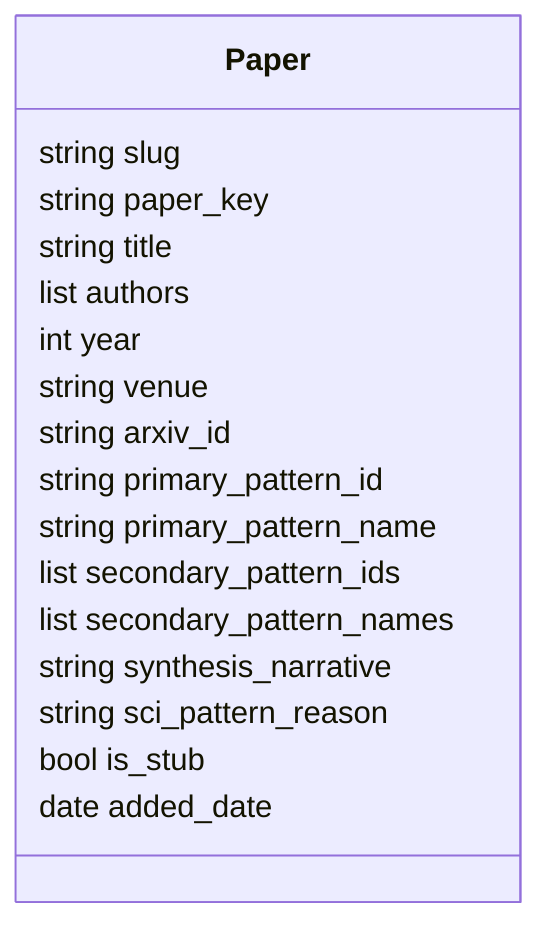
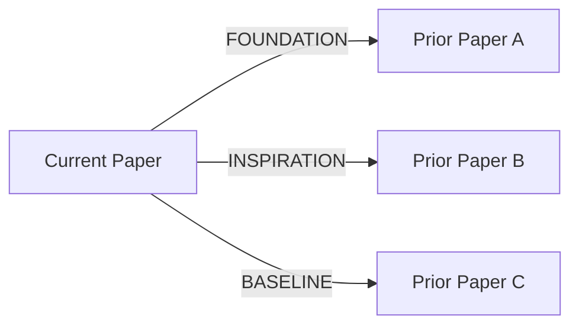
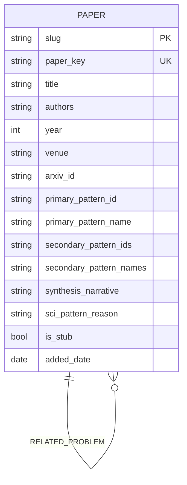
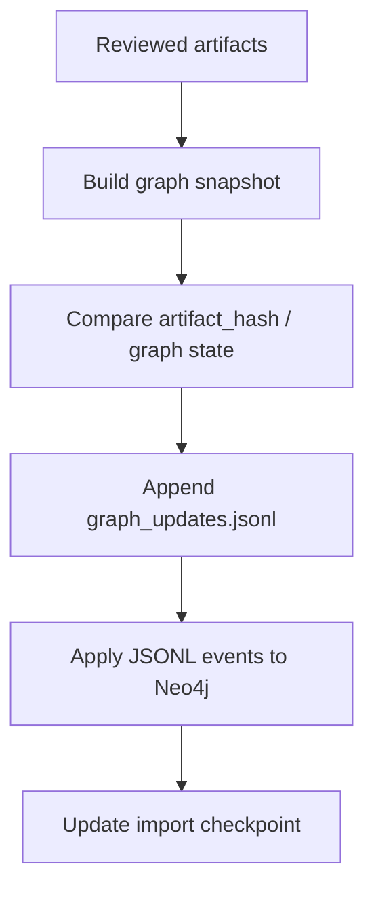
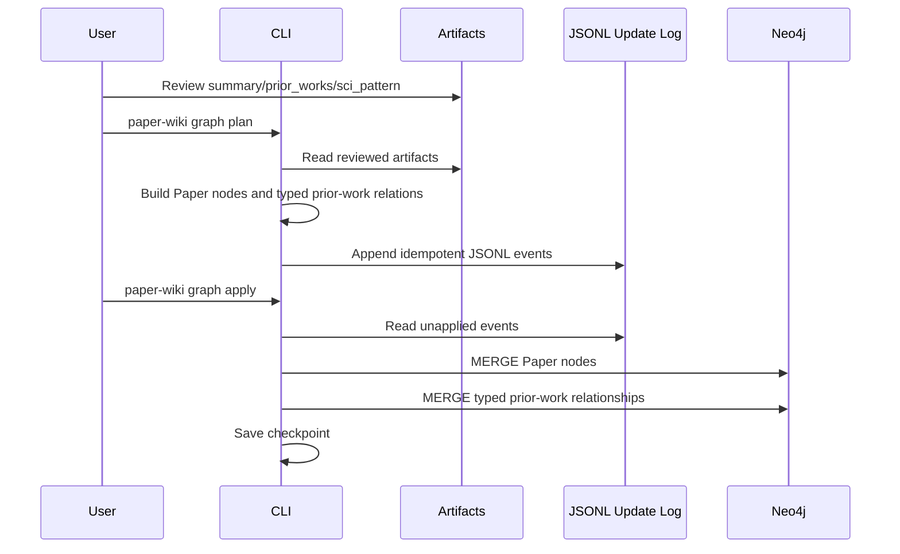

# Neo4j 科学发现图谱需求与技术方案

> 状态：已部分实现 | 创建：2026-07-03 | 最后更新：2026-07-03 | 适用范围：Layer 2 科学发现图谱

---

## 1. 目标

科学发现图谱用于表达论文之间的思想传承关系，核心问题是：

- 一篇论文建立在哪些先前工作之上？
- 一篇先前工作影响了哪些后续论文？
- 某类科学创新范式下有哪些论文，彼此如何演化？
- 两篇论文之间是否存在可解释的研究脉络路径？

第一版图谱应保持克制：只围绕论文节点和论文之间的先前工作关系建模，不提前引入复杂概念图谱、作者消歧、机构网络或检索索引。

---

## 2. 数据来源与人工 Review

Neo4j 图谱不直接从 `raw/` 原始 LaTeX 构建，而是从 `artifacts/{paper-slug}/` 下已经结构化的 Layer 1 三件套构建：

```text
artifacts/{paper-slug}/
├── summary.md
├── prior_works.json
└── sci_pattern.json
```

入库前，用户会人工 Review 三个文件，确保以下信息准确：

- 主论文的 title、authors、year、venue、arXiv ID
- 先前工作的 title、authors、year、arXiv ID
- 当前论文与先前工作的关系角色和关系描述
- 科学创新范式分类与理由

当前实现已把主论文元信息集中维护在 `summary.md` frontmatter 中，避免同一份主论文元信息在三个 artifact 中重复修改。

```text
summary.md frontmatter = 主 Paper 元信息的单一来源
prior_works.json = 先前工作关系来源
sci_pattern.json = 科学创新范式来源
```

---


## 3. 建模原则

第一版只定义一种节点：`Paper`。

先前工作即使还没有完整收录，也仍然可以作为 `Paper` 节点存在，但需要标记为 stub：

```text
is_stub = true
```

当该先前工作未来被正式 ingest 并人工 Review 后，同一个 `Paper` 节点被增量补全：

```text
is_stub = false
```

这样可以避免引入 `ExternalPaper` 节点类型，同时让图谱在早期也能形成完整的思想传承链。

---


## 4. 节点定义


### 4.1 Paper 节点




推荐属性：


| 属性                        | 类型           | 说明                                               |
| ------------------------- | ------------ | ------------------------------------------------ |
| `slug`                    | string       | 已完整收录论文的唯一 ID，对应 `artifacts/{slug}`；stub 节点可自动生成 |
| `paper_key`               | string       | 稳定去重键，优先使用 arXiv ID，否则使用 title + year 归一化结果      |
| `title`                   | string       | 论文标题                                             |
| `authors`                 | list[string] | 作者列表，第一版不拆 Author 节点                             |
| `year`                    | int          | 发表年份                                             |
| `venue`                   | string       | 会议或期刊                                            |
| `arxiv_id`                | string       | arXiv ID，如有                                      |
| `primary_pattern_id`      | string       | 主科学创新范式 ID，例如 `P05`                              |
| `primary_pattern_name`    | string       | 主科学创新范式名称                                        |
| `secondary_pattern_ids`   | list[string] | 次要科学创新范式 ID                                      |
| `secondary_pattern_names` | list[string] | 次要科学创新范式名称                                       |
| `synthesis_narrative`     | string       | `prior_works.json` 中的前作综合叙述                      |
| `sci_pattern_reason`      | string       | `sci_pattern.json` 中的范式分类理由                      |
| `is_stub`                 | bool         | 是否为仅由 prior work 记录创建的占位论文节点                     |
| `added_date`              | date         | 加入知识库日期                                          |


---


## 5. 关系定义


### 5.1 Prior Work 关系类型

论文之间的关系来自 `prior_works.json` 中的 `prior_works` 列表。`prior_works.role` 直接映射为 Neo4j 关系类型，而不是只作为边上的普通属性。

方向定义为：

```text
当前论文 -> 先前工作
```

也就是每条 prior work 记录都会生成一条：

```text
(:Paper)-[:RELATION_TYPE]->(:Paper)
```

其中 `RELATION_TYPE` 由 `role` 归一化得到：


| `prior_works.role`   | Neo4j 关系类型           | 语义                          |
| -------------------- | -------------------- | --------------------------- |
| `Baseline`           | `BASELINE`           | 先前工作是当前论文主要改进或对比的核心系统       |
| `Inspiration`        | `INSPIRATION`        | 先前工作的具体思想直接激发了当前论文的关键创新     |
| `Gap Identification` | `GAP_IDENTIFICATION` | 先前工作的局限或失败推动了当前研究方向         |
| `Foundation`         | `FOUNDATION`         | 先前工作引入了当前论文所用的核心问题定义、数据集或框架 |
| `Extension`          | `EXTENSION`          | 当前论文直接扩展、修改或泛化了先前工作的方法      |
| `Related Problem`    | `RELATED_PROBLEM`    | 先前工作解决了紧密相关问题，其思路启发了当前工作    |





关系不保存额外属性，仅通过 Neo4j 关系类型本身表达语义。


查询全部 prior work 关系时，应显式匹配这六类关系：

```cypher
MATCH (p:Paper)-[r:BASELINE|INSPIRATION|GAP_IDENTIFICATION|FOUNDATION|EXTENSION|RELATED_PROBLEM]->(q:Paper)
RETURN p, r, q;
```

---


## 6. 图谱结构




---


## 7. 增量更新设计

图谱更新必须支持增量执行，避免每次重建全量 Neo4j 数据库。

推荐采用“artifact 快照 -> JSONL 增量事件 -> Neo4j upsert”的三阶段流程：




### 7.1 为什么使用 JSONL

JSONL 适合作为可审计、可重放的增量更新日志：

- 每行是一个独立事件，便于追加写入
- 可以进入 Git 版本管理，方便审查每次图谱变化
- 可以失败后从 checkpoint 继续导入
- 可以先生成事件文件，再单独执行 Neo4j 入库

建议路径：

```text
graph_updates/
└── graph_updates.jsonl
```

如果未来希望按日期切分：

```text
graph_updates/
├── 2026-07-03.jsonl
├── 2026-07-04.jsonl
└── ...
```


### 7.2 事件类型

当前实现包含三类事件：

```json
{"event_id":"...","op":"upsert_paper","paper_key":"...","payload":{},"source_slug":"GraphWalker","artifact_hash":"...","created_at":"2026-07-03T00:00:00Z"}
```

```json
{"event_id":"...","op":"upsert_prior_work_relation","relation_type":"FOUNDATION","source_paper_key":"...","target_paper_key":"...","payload":{},"source_slug":"GraphWalker","artifact_hash":"...","created_at":"2026-07-03T00:00:00Z"}
```

后续如果需要删除关系或标记过期，可扩展：

```text
mark_paper_stale
merge_paper
```


### 7.3 事件幂等性

每个事件必须可重复执行，不应因为重复导入而产生重复节点或重复关系。

建议 `event_id` 由稳定字段生成：

```text
upsert_paper:{paper_key}:{artifact_hash}
upsert_prior_work_relation:{source_paper_key}:{target_paper_key}:{relation_type}:{artifact_hash}
```

Neo4j 入库使用 `MERGE`，而不是无条件 `CREATE`。

---


## 8. paper_key 生成规则

`paper_key` 是图谱去重的关键。

优先级：

1. 有 arXiv ID：`arxiv:{normalized_arxiv_id}`
2. 无 arXiv ID，但有标题和年份：`title_year:{normalized_title}:{year}`
3. 只有标题：`title:{normalized_title_hash}`

标题归一化建议：

- 转小写
- 去除标点
- 合并连续空白
- 去除 LaTeX 转义残留

示例：

```text
arxiv:2509.21035
title_year:attention-is-all-you-need:2017
title:8f14e45f
```

---


## 9. Neo4j 约束与索引

必须创建唯一约束：

```cypher
CREATE CONSTRAINT paper_key_unique IF NOT EXISTS
FOR (p:Paper)
REQUIRE p.paper_key IS UNIQUE;
```

如果 `slug` 只用于完整收录论文，可创建可选索引：

```cypher
CREATE INDEX paper_slug_index IF NOT EXISTS
FOR (p:Paper)
ON (p.slug);
```

常用查询字段建议建立索引：

```cypher
CREATE INDEX paper_year_index IF NOT EXISTS
FOR (p:Paper)
ON (p.year);

CREATE INDEX paper_pattern_index IF NOT EXISTS
FOR (p:Paper)
ON (p.primary_pattern_id);
```

---


## 10. 入库流程




当前实现的命令分为两步：

```bash
paper-wiki graph plan
paper-wiki graph apply
```

或者单篇增量：

```bash
paper-wiki graph plan GraphWalker
paper-wiki graph apply --since-checkpoint
```

`plan` 只生成 JSONL 事件，不连接 Neo4j；`apply` 只负责把事件幂等写入 Neo4j。这样便于测试、Review 和失败恢复。

---


## 11. 可维护性要求

实现时应遵守以下工程约束：

- 不读取或修改 `raw/`，图谱只从 reviewed artifacts 派生
- 不在 ingest 阶段直接写 Neo4j，避免 Layer 1 生成和 Layer 2 入库耦合
- JSON artifact 入库前必须通过 Pydantic models 校验
- `summary.md` frontmatter 中的 `reviewed` 应作为默认入库门槛
- `graph plan` 与 `graph apply` 分离，便于测试和人工审查
- Neo4j 写入必须使用唯一约束和 `MERGE` 保证幂等
- 增量状态应有 checkpoint，不依赖“上次命令是否成功”的隐式状态
- 测试应优先覆盖纯函数：paper_key 生成、artifact -> events 转换、JSONL 读写、Cypher 参数构造
- 真实 Neo4j 集成测试应显式启用，不应成为默认单元测试依赖

---


## 12. 备选方案


### 12.1 只用 JSONL，不维护 snapshot

优点：实现简单。  
缺点：难以判断 artifact 修改后哪些旧关系需要过期或删除。

### 12.2 维护当前图谱 snapshot

除 JSONL 外，维护一个派生快照：

```text
graph_state/
├── papers.json
└── prior_work_relations.json
```

优点：便于 diff、删除过期关系、生成可读 Review。  
缺点：多维护一份派生状态。

### 12.3 推荐方案

第一版推荐：

```text
reviewed artifacts
  -> graph_state snapshot
  -> graph_updates.jsonl
  -> Neo4j MERGE
```

其中 `graph_state/` 和 `graph_updates/` 都是 Layer 2 派生产物，不属于当前 Layer 0/Layer 1 ingest 范围。

---


## 13. MVP 范围

第一版只实现：

- `Paper` 节点
- `BASELINE`、`INSPIRATION`、`GAP_IDENTIFICATION`、`FOUNDATION`、`EXTENSION`、`RELATED_PROBLEM` 六类 prior work 关系
- reviewed artifacts 到 graph snapshot 的转换
- JSONL 增量事件生成
- JSONL 事件幂等写入 Neo4j
- 基础查询：溯源、影响力、按范式筛选

暂不实现：

- Author 节点
- Concept 节点
- Venue 节点
- 向量检索
- GraphRAG
- HTTP API
