# Paper-Wiki 技术方案 v1.5

> 作者：架构设计草稿 | 创建：2026-06-24 | 最后更新：2026-07-14 | 状态：持续维护

---

## 零、当前实现状态

本文档是长期维护文档，既记录已经落地的工程设计，也保留后续 Layer 2/Layer 3 的规划。每次功能实现、架构调整或范围变更后，都应同步更新本节与相关设计章节。Web v1 原型现在作为本地审查工作站入口存在，但不等同于 Layer 3 检索 API。

| 层次 | 当前状态 | 已落地内容 | 尚未落地内容 |
| ---- | -------- | ---------- | ------------ |
| Layer 0 | 已实现 | `LaTeXParser`、入口文件识别、`\input` / `\include` 内联、核心章节抽取、`paper-wiki parse` | 更复杂 LaTeX 语义解析、PDF OCR/正文回退 |
| Layer 1 | 已实现 | `assets/` 包、`PaperAssetsBuilder`、`AssetsReader`、`PaperAssetsBundle` canonical input、最小 assets contract、`paper-wiki assets <slug...>`、`IngestPipeline` 先构建/复用 assets 再按独立 step 生成 `summary.md`、`prior_works.json`、`sci_pattern.json`，并在 summary 新生成后追加 JSON 语义产物派生的范式/前作综合补充；`SummaryGenerator`、`PriorWorksGenerator`、`PatternGenerator`、Pydantic 校验、prompt 切换、单篇/多篇 `paper-wiki ingest`、`--only` 单语义产物重跑、raw 扫描式 `paper-wiki ingest-all`，并将主论文元信息和 review 状态统一保存在 `manifest.json` 的 `paper` 字段 | 正式 review 命令 |
| 发现层 | 已实现 | `discovery/` 包、`paper-wiki search`、`paper-wiki fetch`、`paper-wiki recommend run`、arXiv export API 检索、按 arXiv ID 下载源码/PDF 到 `raw/{slug}/`、RSS 优先且 export API submittedDate fallback 的每日候选池（`normalize_arxiv_id` 已剥离 RSS `oai:arXiv.org:` 前缀）、Zotero 语料、sentence-transformers 重排序、`.recommendations/{date}.json` / `latest.json` 快照、Web 接入（`/api/recommendations/*`、`/api/search`、`/api/papers/fetch`） | 多源检索、本地 reviewed 论文语料源 |
| Layer 2 | 部分实现 | `graph/` 包、reviewed artifacts 读取、Paper 节点与 typed prior-work 关系建模、`graph_state/` 快照、`graph_updates.jsonl` 事件日志、`paper-wiki graph plan/apply`、Neo4j 幂等入库；详见 [Neo4j 科学发现图谱需求与技术方案](./Neo4j%20科学发现图谱需求与技术方案.md) | `wiki/` 包、全局目录、概念页、日志、更多图谱查询 |
| 发布扩展 | 已实现 | `publishing/` 包、`paper-wiki publish wechat`、artifact HTML 定位、HTML 基础校验、本地图片上传替换、微信公众号草稿创建 | 自动群发/发布、发布记录归档、完整微信 HTML 兼容性 lint |
| Web 原型 | 已实现 | `web/` FastAPI 入口层、`PaperRepository` 文件系统状态读写、manifest 乐观锁、内存 `JobManager`（`JobRecord.result` 携带任务返回值）、`recommendations`/`search` router、`papers` router 上的 `fetch`/`batch-ingest`、`paper-wiki web`、`web/frontend` Vite React 原型（`TodayFeed`/`SearchAndAdd`/`Dashboard`/`PaperDetail`）、Web API/前端测试 | 上传入口、图谱可视化、多平台发布、鉴权、持久化任务队列 |
| Layer 3 | 未实现 | 无 | `retrieval/` 包、向量库、GraphRAG、FastAPI API |
| 测试 | 部分实现 | parser、assets builder、models、mock LLM pipeline、CLI 多 slug ingest/assets、raw 待处理发现、discovery 单元/集成测试（含 RSS `oai:` id 归一化回归测试）、Web discovery 路由单元测试、graph planner 增量事件、微信公众号发布 mock 测试；当前 `pytest` 66 passed | graph/retrieval/api/e2e 测试、真实微信 API smoke test |

当前实现范围必须继续遵守 Layer 0/Layer 1 边界：assets 与 ingest 只生成 `artifacts/{paper-slug}/` 下的 deterministic assets 和独立语义产物，不写入 `wiki/`、图谱、embedding 或检索索引。

## 一、技术选型


| 层次           | 选型                         | 理由                         |
| ------------ | -------------------------- | -------------------------- |
| 语言           | Python 3.11+               | 生态最丰富，LLM/向量库均有一流支持        |
| LLM API      | OpenAI-compatible API（已实现 OpenAI/DeepSeek 配置分支） | 通过统一 SDK 与 `.env` 支持模型切换 |
| LaTeX 解析     | 自实现预处理（正则 + 文件拼接）          | 轻量，负责入口识别、`\input` / `\include` 内联、章节与 assets 抽取 |
| LaTeX → Markdown 正文规范化 | Pandoc via `pypandoc_binary`，失败时回退到本地规则 | 普通段落、列表、引用、行内样式由 Pandoc 统一转换；图片落盘、references、复杂表格/算法块仍由 assets builder 控制 |
| 向量库          | ChromaDB（规划）              | 本地持久化、内置元数据过滤、无需部署         |
| Embedding 模型 | BGE / OpenAI embedding（规划） | 精度与成本平衡                    |
| 图谱存储         | 本地 `graph_state/` + `graph_updates.jsonl`，Neo4j 增量入库（部分实现） | 本地快照便于审计，Neo4j 支撑后续图查询 |
| HTTP API     | FastAPI（Web v1 已用于本地审查工作站；Layer 3 检索 API 仍规划中） | 异步、自动 OpenAPI 文档、类型安全      |
| 数据模型         | Pydantic v2                | 验证 + 序列化 + JSON schema 一体化 |
| CLI          | Typer                      | 基于 Pydantic，与 FastAPI 风格统一 |
| 配置管理         | pydantic-settings + `.env` | 统一管理 API Key 和路径配置         |
| HTTP Client      | requests                   | 调用微信公众号 token、素材、草稿箱 API |
| HTML 处理        | BeautifulSoup              | 解析并替换 artifact HTML 中的本地图片引用 |
| 测试           | pytest + pytest-asyncio    | 标准，支持异步测试                  |
| 依赖管理         | conda                      | 速度快，现代 Python 标准           |


---

## 二、系统架构总览

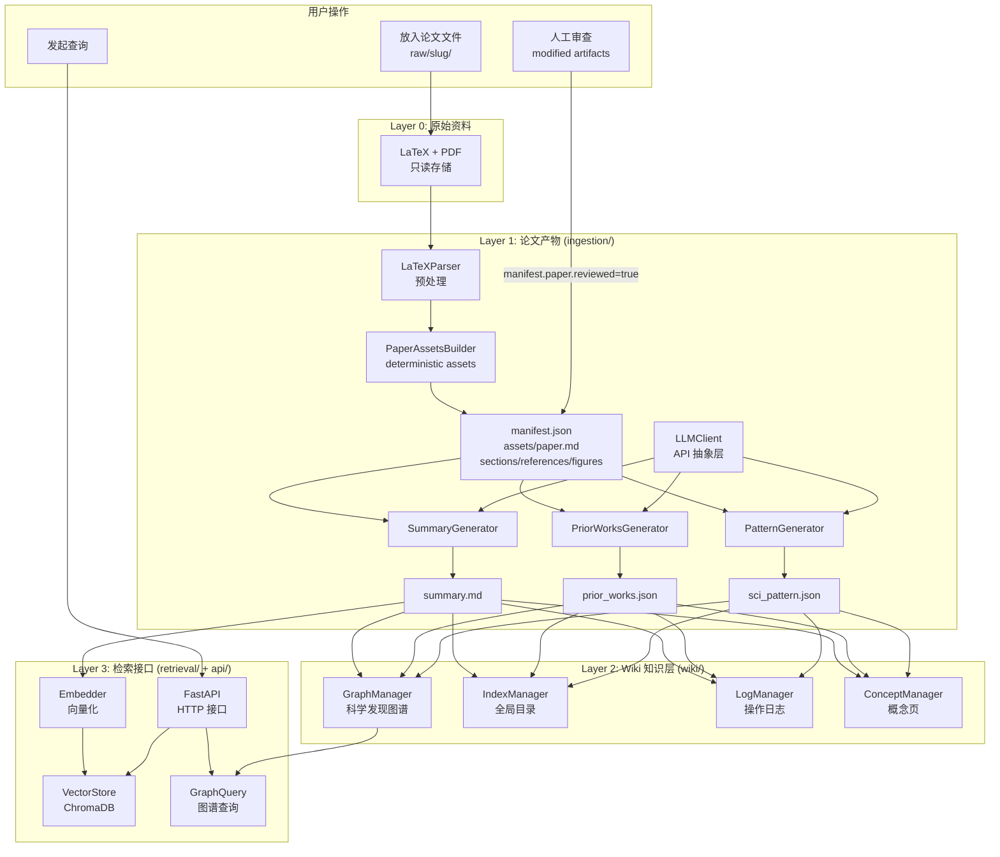


---

## 三、包结构设计

本节同时展示已实现包与规划包。当前代码仓库已经落地 `core/`、`assets/`、`ingestion/`、`discovery/`、`cli/`、`graph/`、`publishing/`；`wiki/`、`retrieval/`、`api/` 仍属于后续阶段，不应在非相关任务中提前实现。

```
paper_wiki/                         # 主 Python 包
│
├── core/                           # 核心领域模型（无外部依赖）
│   ├── __init__.py
│   ├── models.py                   # 所有 Pydantic 数据模型
│   ├── enums.py                    # 枚举：角色、范式、贡献类型
│   └── config.py                   # 全局配置（路径、API Key）
│
├── assets/                         # Layer 0 → Layer 1 deterministic assets（已实现）
│   ├── __init__.py
│   ├── builder.py                  # 构建 manifest/paper.md/sections/figures/references
│   └── models.py                   # AssetsManifest、SectionsDoc、FiguresDoc、ReferencesDoc
│
├── ingestion/                      # Layer 0 → Layer 1
│   ├── __init__.py
│   ├── latex_parser.py             # LaTeX 预处理与拼接
│   ├── llm_client.py               # LLM API 抽象接口
│   ├── generators/
│   │   ├── summary_generator.py    # 生成 summary.md
│   │   ├── prior_works_generator.py # 生成 prior_works.json
│   │   └── pattern_generator.py    # 生成 sci_pattern.json
│   └── pipeline.py                 # Ingest 流程编排入口
│
├── graph/                          # Layer 1 → Layer 2（已部分实现）
│   ├── __init__.py
│   ├── artifact_reader.py          # 读取 reviewed artifacts
│   ├── models.py                   # 图谱节点、关系、事件与状态模型
│   ├── planner.py                  # artifact -> graph state / JSONL events
│   ├── neo4j_store.py              # Neo4j 幂等写入与查询
│   └── state_store.py              # graph_state / graph_updates 持久化
│
├── publishing/                      # Layer 1 artifact → 外部渠道（已实现）
│   ├── __init__.py
│   ├── artifact_html.py             # 定位和读取 artifacts/{slug}/ 下的 HTML
│   ├── html_processor.py            # HTML 基础校验、本地图片发现与 src 替换
│   ├── models.py                    # WeChatDraftOptions、WeChatDraftResult 等模型
│   ├── wechat_client.py             # 微信 token、图片上传、草稿创建 API client
│   └── wechat_publisher.py          # 读取 HTML -> 上传图片 -> 创建草稿的编排入口
│
├── discovery/                       # 发现层（已实现）
│   ├── __init__.py
│   ├── models.py                    # SearchCandidate、FetchResult、RecommendationSnapshot 等
│   ├── exceptions.py                # DiscoveryError / Search / Fetch / Recommend 相关异常
│   ├── rate_limit.py                # arXiv 跨进程节流
│   ├── search.py                    # Paper2Search 门面：search/fetch/daily_candidates/zotero_corpus
│   ├── recommend.py                 # Paper2Recommend：Zotero语料 + arXiv候选 + embedding重排序
│   └── sources/
│       ├── arxiv_source.py          # arXiv export API、RSS fallback、源码/PDF下载
│       └── zotero_source.py         # Zotero API 语料拉取与 ID 归一化
│
├── wiki/                           # Layer 1 → Layer 2 wiki 页面层（规划，未实现）
│   ├── __init__.py
│   ├── index.py                    # wiki/index.md 维护
│   ├── concepts.py                 # wiki/concepts/ 维护
│   └── log.py                      # wiki/log.md 维护
│
├── retrieval/                      # Layer 2 → Layer 3（规划，未实现）
│   ├── __init__.py
│   ├── embedder.py                 # 向量化文档，写入 ChromaDB
│   ├── vector_store.py             # ChromaDB 封装
│   ├── graph_query.py              # 图谱遍历查询（溯源、路径、邻居）
│   └── search.py                   # 统一检索入口（向量 + 图谱混合）
│
├── api/                            # HTTP API（规划，未实现）
│   ├── __init__.py
│   ├── app.py                      # FastAPI 应用入口
│   └── routes/
│       ├── papers.py               # /papers 路由
│       ├── search.py               # /search 路由
│       └── graph.py                # /graph 路由
│
└── cli/                            # 命令行工具
    ├── __init__.py
    └── main.py                     # typer CLI 入口

tests/
├── unit/                           # 单元测试（无 LLM 调用）
│   ├── test_latex_parser.py
│   ├── test_assets_builder.py
│   ├── test_models.py
│   └── test_cli.py
├── integration/                    # 集成测试（Mock LLM）
│   └── test_pipeline.py
└── fixtures/
    ├── sample_paper/               # 测试用论文片段
    │   ├── main.tex
    │   └── sections/
    └── expected/                   # 期望输出（快照测试）
        ├── summary.md
        ├── prior_works.json
        └── sci_pattern.json

prompts/                            # Prompt 模板（与代码解耦）
├── paper_summary.py
├── paper_summary_v2.py
├── paper_summary_v3.py              # 当前默认 summary prompt
├── prior_work_prompt.py
├── sci_pattern_classify_prompt.py
└── pattern_taxonomy.json

pyproject.toml
.env.example
AGENTS.md                           # LLM 操作规范
```

### 包依赖关系

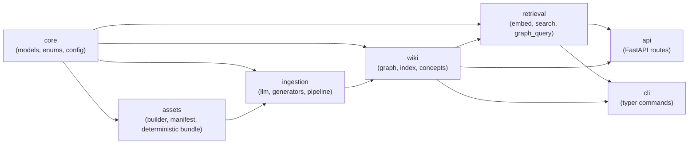


`core` 是零依赖的纯领域模型层，所有其他模块单向依赖它，不允许循环依赖。

---

## 四、数据模型设计

### 4.1 核心枚举

```python
# core/enums.py

class PriorWorkRole(str, Enum):
    BASELINE = "Baseline"
    INSPIRATION = "Inspiration"
    GAP_IDENTIFICATION = "Gap Identification"
    FOUNDATION = "Foundation"
    EXTENSION = "Extension"
    RELATED_PROBLEM = "Related Problem"

class ContributionType(str, Enum):
    PROBLEM_DEFINITION = "问题定义型"
    MECHANISM_EXPLANATION = "机制解释型"
    METHOD_IMPROVEMENT = "方法改进型"
    BENCHMARK = "评测基准型"

class PatternID(str, Enum):
    P01 = "P01"  # Gap-Driven Reframing
    P02 = "P02"  # Cross-Domain Synthesis
    # ... P03-P15
```

### 4.2 Paper Assets 模型

`assets/models.py` 定义最小 paper assets contract。所有 JSON assets 在写入前都需要通过 Pydantic 校验。

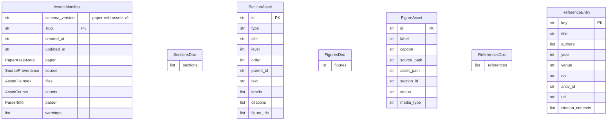

当前文件 contract：

| 文件 | 模型 | 说明 |
| ---- | ---- | ---- |
| `manifest.json` | `AssetsManifest` | bundle 入口、source provenance、文件索引、计数和 warnings |
| `assets/paper.md` | Markdown 文本 | 规范化主文，供 LLM 和人工 debug 复用 |
| `assets/sections.json` | `SectionsDoc` | section 粒度结构，不拆 paragraph/block |
| `assets/figures/manifest.json` | `FiguresDoc` | 图片源路径、asset 路径、caption、label 和状态 |
| `assets/references.json` | `ReferencesDoc` | `.bib` / `.bbl` / citation context 的 structured references |

当前 `AssetFileIndex` 只允许索引上述 assets contract 文件；`summary.md`、`prior_works.json`、`sci_pattern.json` 是 assets 的下游产物，不出现在 assets manifest 的文件索引中。

### 4.3 论文元数据（YAML Frontmatter）

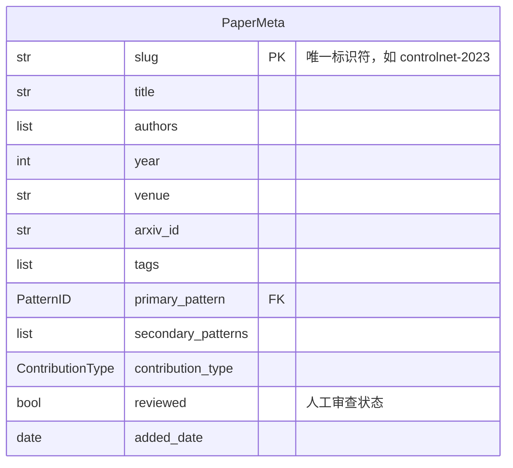


### 4.4 先前工作文档

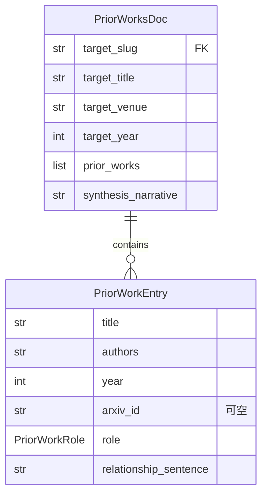

**已实现：arXiv 静默回填**（`src/paper_wiki/ingestion/prior_works_backfill.py`）——`PriorWorksGenerator` 生成的 `prior_works.json` 里，LLM 只能从论文正文/参考文献抽取 `title`/`authors`/`year`，`arxiv_id` 恒为空。`IngestPipeline.run()` 在写入 `prior_works.json` 之前，会对每条 `arxiv_id` 为空的 `PriorWorkEntry`，用其 `title` 调用与检索页相同的 `discovery_search.search()`，在候选里找标题相似度（`difflib` 归一化后 ratio ≥ 0.82）足够高的第一条，把 `title`/`authors`/`year`/`arxiv_id` 回填成 arXiv 的规范值；找不到可信匹配或检索失败时保留 LLM 原始抽取结果，不中断 ingest。已有 `arxiv_id`（例如人工审查后保留的）不会被覆盖。整个过程是生成流程的一环，对用户无感知，人工审查阶段看到的就是回填后的数据，仍需人工确认匹配是否正确。


### 4.5 科学范式分类文档

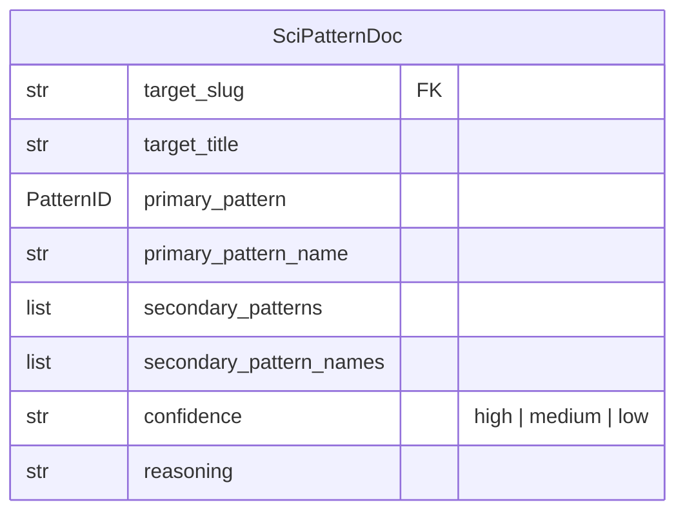


### 4.6 图谱节点与边

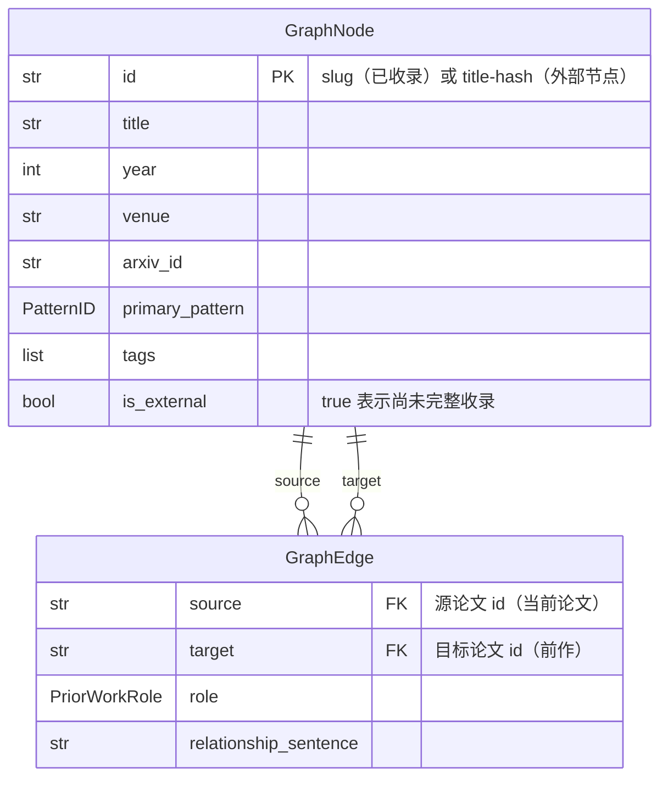


### 4.7 完整数据流 ER 图

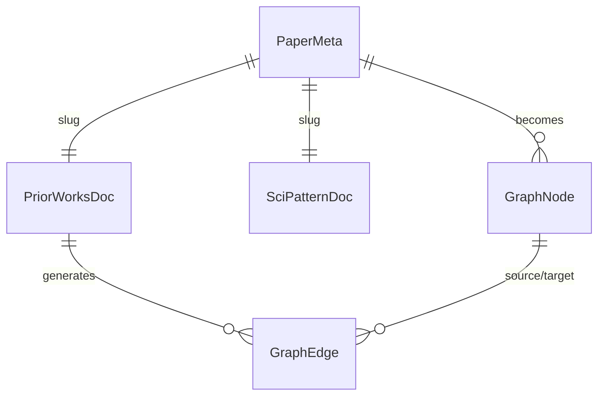


---

## 五、核心模块详细设计

### 5.1 `assets/builder.py`

**职责**：从 `raw/{slug}/` 构建 `artifacts/{slug}/` 下的 deterministic assets bundle，不调用 LLM。

输出文件：

```text
artifacts/{slug}/
├── manifest.json
└── assets/
    ├── paper.md
    ├── sections.json
    ├── figures/
    │   ├── manifest.json
    │   └── ...
    └── references.json
```

当前接口：

```python
class PaperAssetsBuilder:
    def build(self, slug: str, *, overwrite: bool = False) -> AssetsBuildResult: ...

class AssetsReader:
    def load(self, slug: str) -> PaperAssetsBundle: ...
```

**当前已实现关键设计**：

- `build()` 只做 deterministic 解析、文件复制/渲染、JSON 写入和 Pydantic 校验，不调用 LLM
- 默认不覆盖已有 assets；传入 `--overwrite` / `overwrite=True` 时才允许重写
- `manifest.json` 记录 schema 版本、slug、source provenance、文件索引、计数、parser 信息和 warnings
- 所有产物只写入 `artifacts/{slug}/`，不修改 `raw/`
- 普通 LaTeX 正文优先经 Pandoc 转 Markdown；若 Pandoc 不可用或转换失败，则自动回退到本地正则规则
- Pandoc 只用于文本层规范化，不负责 assets contract 本身：图片路径仍以 `assets/figures/manifest.json` 为准；复杂表格、算法、prompt、代码块等作为 fenced LaTeX block 保留，避免 `\multirow`、`\shortstack`、`\cmark` 等论文宏在转换中丢信息

**Assets-first canonical input 设计**：

- `src/paper_wiki/assets/reader.py` 提供 `AssetsReader`
- `assets/models.py` 提供 `PaperAssetsBundle`
- `assets` 层不再导入或返回 `ParsedPaper`；`ParsedPaper` 只保留给 `paper-wiki parse` 调试入口
- `PaperAssetsBuilder.build()` 只返回 `AssetsBuildResult` 路径和计数，不携带下游 prompt 输入对象
- `AssetsReader.load(slug)` 读取 `manifest.json`、`assets/paper.md`、`assets/sections.json`、`assets/figures/manifest.json`、`assets/references.json`，返回统一的 `PaperAssetsBundle`
- `PaperAssetsBundle` 是所有 Layer 1 下游的唯一 canonical input；summary、prior works、sci pattern、公众号/blog/RAG 预备流程不得重新解析 `raw/`
- `AssetFileIndex` 只索引 assets contract 文件，不再混入 `summary.md`、`prior_works.json`、`sci_pattern.json` 等 LLM 下游产物
- summary 中的图片引用应直接来自 `assets/figures/manifest.json` 的 `asset_path`，不再走 raw 图片路径改写或 summary PDF 后处理

`PaperAssetsBundle` 推荐结构：

```python
class PaperAssetsBundle(BaseModel):
    slug: str
    artifact_dir: Path
    manifest: AssetsManifest
    paper_markdown: str
    sections: SectionsDoc
    figures: FiguresDoc
    references: ReferencesDoc

    def llm_context(self, targets: list[str] | None = None, max_chars: int | None = None) -> str: ...
    def figure_markdown_paths(self) -> dict[str, str]: ...
    def citation_contexts(self) -> dict[str, list[CitationContext]]: ...
```

`llm_context()` 可以保留现有按核心章节组装 prompt 的策略，但它属于 assets bundle 的读取视图，不应再通过 `ParsedPaper.raw_text` 传递。

### 5.2 `ingestion/latex_parser.py`

**职责**：将 `raw/{slug}/` 目录下的 LaTeX 文件预处理为适合 LLM 消费的纯文本。

#### 核心问题

LaTeX 论文有两种常见组织形式，Parser 需要同时支持：

```latex
% 方式 A：内容全写在 main.tex
\section{Introduction}
正文内容直接写在这里...

% 方式 B：main.tex 通过 \input / \include 引用子文件
\input{sections/introduction}
\include{method}
\input{experiments.tex}
```

因此处理分为两个阶段：**先把所有文件合并**，再**按 `\section` 定位目标章节**。

#### 完整处理流程

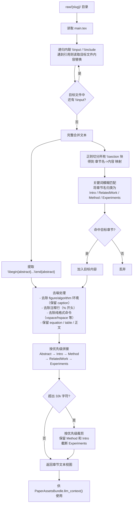

#### 章节名模糊匹配规则

论文章节名没有统一规范，使用关键词列表匹配：

```python
TARGET_SECTIONS: dict[str, list[str]] = {
    "introduction": ["introduction", "motivation", "overview"],
    "related_work": ["related work", "background", "prior work",
                     "literature review", "related"],
    "method":       ["method", "approach", "model", "framework",
                     "proposed", "our method", "methodology",
                     "technique", "algorithm"],
    "experiments":  ["experiment", "evaluation", "result",
                     "empirical", "analysis", "benchmark"],
}
# abstract 单独处理：走 \begin{abstract}...\end{abstract} 环境
```

匹配逻辑：章节名小写后，检查是否包含任意关键词。`\subsection` 也参与匹配，但优先级低于 `\section`（用于 Related Work 作为 Introduction 子节的情况）。

#### 边界情况处理

| 情况 | 处理方式 |
|------|---------|
| `\section[短标题]{完整标题}` | 提取 `{...}` 中的完整标题，忽略 `[...]` |
| `\input{method}` 无扩展名 | 自动补 `.tex` 后缀后在 `paper_dir` 下搜索 |
| `\input{sections/method}` 带路径 | 相对于 `paper_dir` 解析路径 |
| 循环 `\input` 引用 | 维护 `visited: set[Path]`，已访问文件跳过 |
| Related Work 是 Intro 的 `\subsection` | `\subsection` 也做关键词匹配，优先级低于 `\section` |
| 论文无 `main.tex` | 按文件大小降序取最大的 `.tex` 文件作为入口 |

#### 接口定义

```python
class LaTeXParser:
    def find_entry_file(self, paper_dir: Path) -> Path: ...
    def inline_inputs(self, tex_path: Path, base_dir: Path) -> str: ...
    def split_by_section(self, text: str) -> dict[str, str]: ...
    def match_target_sections(self, sections: dict[str, str]) -> dict[str, str]: ...

    def _inline_inputs(self, tex_path: Path, base_dir: Path,
                       visited: set[Path] | None = None) -> str:
        """递归内联 \\input / \\include，防止循环引用"""

    def _split_by_section(self, text: str) -> dict[str, str]:
        """用正则 r'\\section\\*?\\{([^}]+)\\}' 切分，返回 {章节名: 内容}"""

    def _match_target_sections(self, sections: dict[str, str]
                                ) -> dict[str, str]:
        """关键词模糊匹配，返回 {intro/method/... : content}"""

    def _strip_latex_noise(self, text: str) -> str:
        """去除 figure/algorithm 环境、注释行、格式命令"""

    def _assemble_and_truncate(self, abstract: str,
                                sections: dict[str, str],
                                max_chars: int = 32000) -> str:
        """为 PaperAssetsBundle.llm_context() 提供按优先级拼接并按需截断的视图"""
```

目标架构中，`LaTeXParser` 不再向 Layer 1 下游输出临时 `ParsedPaper`。它只提供入口识别、文件内联、基础清洗与章节定位能力；跨模块输入由 `AssetsReader.load()` 返回的 `PaperAssetsBundle` 承担。CLI `parse` 可保留为调试入口，但其展示内容应来自同一套 assets 构建/读取逻辑，避免形成第二条解析链路。

---

### 5.3 `ingestion/llm_client.py`

**职责**：抽象 LLM API 调用，屏蔽具体模型差异，支持 OpenAI-compatible 模型切换。

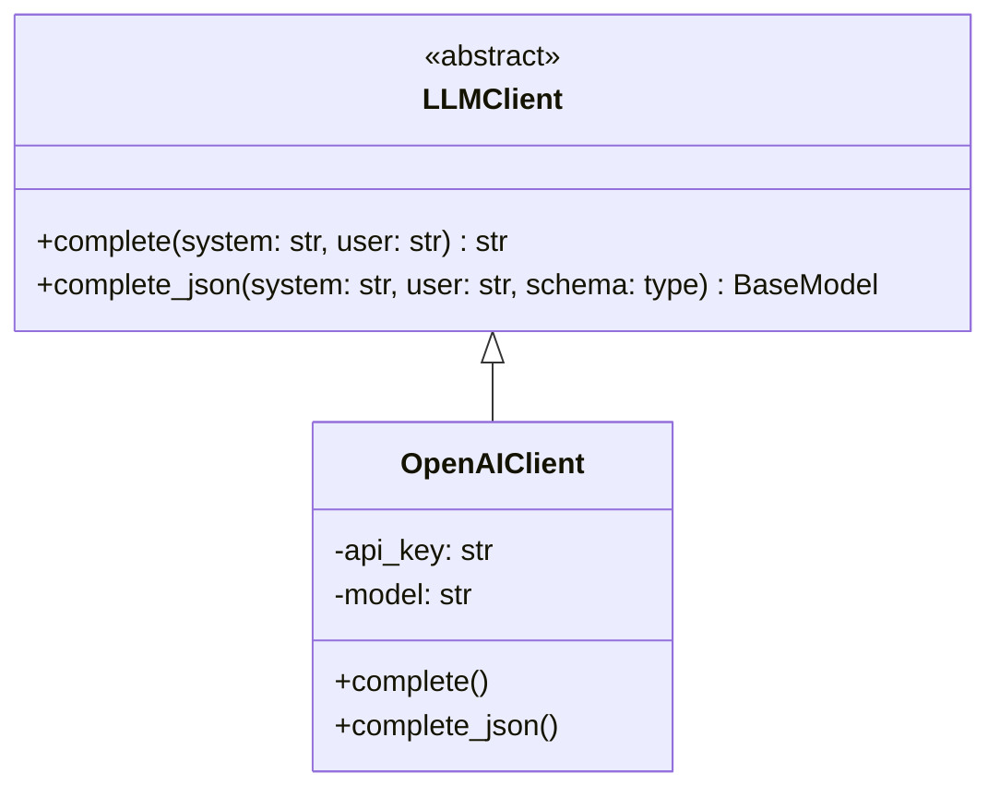


**关键设计**：

- `complete_json()` 内置 JSON 解析重试，处理 LLM 输出非法 JSON 的情况
- 通过 `API_KEY` / `BASE_URL` / `MODEL_NAME` 以及 OpenAI-style aliases 配置模型
- 当前已实现 OpenAI-compatible 客户端；token 用量与成本追踪仍未实现

---

### 5.4 `ingestion/pipeline.py`

**职责**：Ingest 流程的编排入口，当前协调 AssetsBuilder + 可独立执行的语义产物 Generator，并写入 Layer 1 artifacts。Wiki 更新属于后续 `review` 阶段，尚未实现。

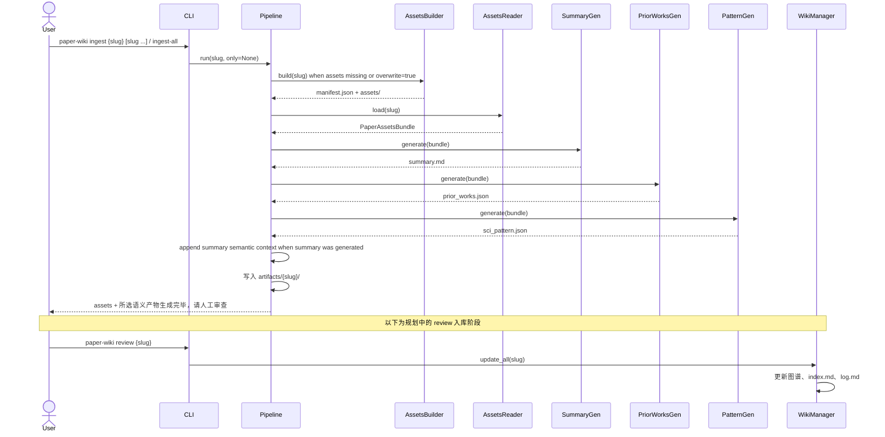


**已实现关键设计**：

- Pipeline 保持单篇论文职责，CLI 负责把单个或多个 slug 逐个送入 Pipeline
- Pipeline 在语义产物生成前先构建或复用 `manifest.json` 与 `assets/`
- CLI 的 `ingest-all` 会扫描 `raw/` 下包含 `.tex` 的论文目录，默认只选择缺少所选 Layer 1 产物的 slug；`--overwrite` 会选择全部 raw 论文
- 默认不覆盖已有 artifact，只有传入 `--overwrite` 时才允许重写所选语义产物
- 支持切换 summary、prior works、sci pattern 三类 prompt
- 支持 `--only summary|prior_works|sci_pattern`，可单独重跑某个语义产物；`prior-works` 和 `pattern` 是 CLI 别名
- 当本次生成了 `summary.md` 时，Pipeline 会在全部所选 step 完成后读取本次生成或磁盘已有的 `prior_works.json` / `sci_pattern.json`，把主要/次要科学发现范式和分类理由追加到 `## 科学发现范式`，把 `synthesis_narrative` 追加到 `## 先前工作分析`
- `prior_works` step 生成结果写盘前，会对每条缺 `arxiv_id` 的前作做一次 arXiv 标题回填（见 4.4 节），过程对用户无感知；单条检索失败或匹配度不足只跳过该条，不影响其余产物生成
- ingest 不写入 `wiki/`、图谱、embedding 或检索索引

**当前流程**：

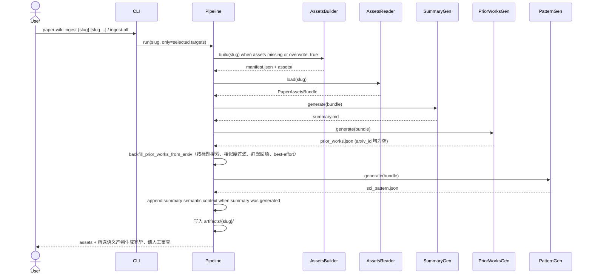

**规划设计**：

- `ingest` 和 `review` 是两个独立命令，强制分离"生成"与"入库"
- Pipeline 支持 `--only summary|prior_works|sci_pattern` flag，可单独重跑某一步
- review 阶段只接收 `manifest.paper.reviewed=true` 的 artifact，并触发 Wiki / Graph / Index 更新

---

### 5.5 `wiki/` 模块（规划，未实现）

**职责**：维护跨论文 wiki 页面层，包括 `wiki/index.md`、`wiki/concepts/` 与 `wiki/log.md`。科学发现图谱的规划与实现已经迁移到独立 `graph/` 包，不再新增旧式 `wiki/graph.py` 或 NetworkX/JSON 双轨实现。

**关键设计**：

- `wiki/` 只负责人可读知识页面，不负责图谱事件、Neo4j 写入或图查询
- 页面更新应发生在人工 review 之后，而不是 `ingest` 阶段
- 需要引用图谱关系时，通过已实现的 `graph/` 包或后续图查询接口读取，不直接维护第二份图结构

---

### 5.6 `retrieval/` 模块（规划，未实现）

**两种检索模式**：

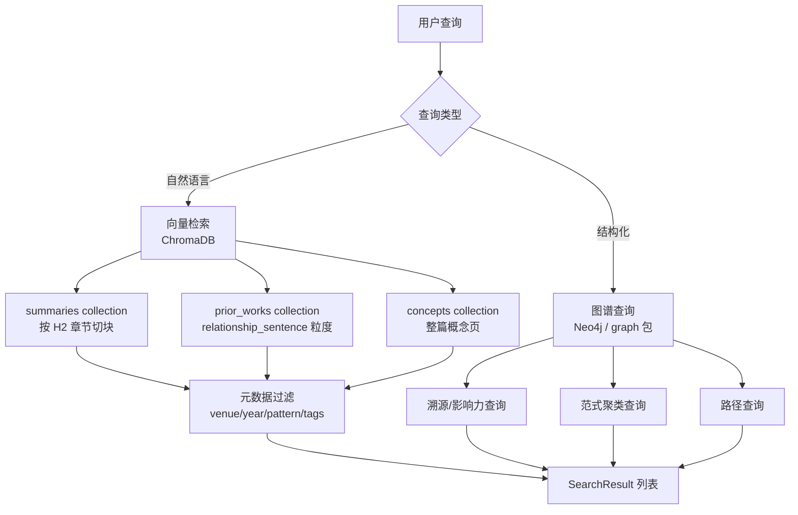


**ChromaDB Collections 设计**：


| Collection    | 文档单元                     | Metadata 字段                                            |
| ------------- | ------------------------ | ------------------------------------------------------ |
| `summaries`   | summary.md 按 H2 章节切分     | slug, year, venue, primary_pattern, tags, section_name |
| `prior_works` | 每条 relationship_sentence | slug, role, target_title                               |
| `concepts`    | 整篇概念 Markdown            | concept_name, related_slugs                            |


**关键设计**：只有 `manifest.json` 中 `paper.reviewed=true` 的 artifact 才会被 Embedder 索引。

---

## 六、API 设计（规划，未实现）

### 6.1 路由总览

```
POST   /assets/{slug}                   触发 deterministic assets 构建（不调用 LLM）
POST   /ingest/{slug}                   触发 Ingest（先构建/复用 assets，再生成所选语义产物）
PATCH  /papers/{slug}/review            标记为已审查，触发 Wiki 更新
GET    /papers/{slug}                   获取论文详情（assets manifest + 语义产物）
GET    /papers/{slug}/summary           获取 summary.md 内容
GET    /papers/{slug}/prior-works       获取 prior_works.json
GET    /papers/{slug}/pattern           获取 sci_pattern.json

GET    /search?q=&pattern=&year_min=&venue=   语义搜索 + 元数据过滤
GET    /graph/{slug}/ancestors?depth=2        溯源查询
GET    /graph/{slug}/descendants?depth=2      影响力查询
GET    /graph/path?from={slug}&to={slug}      路径查询
GET    /graph/pattern/{pattern_id}            范式聚类

GET    /wiki/index                      获取全局目录
GET    /wiki/concepts/{name}            获取概念页
GET    /wiki/log?limit=20              获取操作日志
```

### 6.2 统一响应格式

```python
class APIResponse(BaseModel, Generic[T]):
    data: T
    total: int | None = None
    message: str = "ok"

class SearchResult(BaseModel):
    slug: str
    title: str
    score: float
    source_type: str       # "summary" | "prior_works" | "concept"
    section: str | None    # 命中的章节名
    snippet: str           # 上下文片段
    metadata: PaperMeta
```

---

## 七、CLI 命令设计

```bash
# 已实现：Layer 0 / Layer 1
paper-wiki parse {slug}                       # 解析 LaTeX，打印 Layer 0 摘要
paper-wiki assets {slug} [slug ...]           # 构建 deterministic assets，不调用 LLM
paper-wiki ingest {slug}                      # 生成单篇 assets + 语义产物（不入库）
paper-wiki ingest {slug1} {slug2} --overwrite # 批量生成多篇 assets + 语义产物
paper-wiki ingest {slug} --only pattern -f    # 只重跑 sci_pattern.json
paper-wiki ingest-all                         # 扫描 raw/，生成未完成 Layer 1 产物的论文
paper-wiki search "RAG with graph"            # arXiv export API 检索候选论文
paper-wiki fetch 2406.00552                   # 下载 arXiv 源码/PDF 到 raw/{slug}/
paper-wiki fetch 2406.00552 --and-ingest      # 拉取后立即复用 IngestPipeline 生成 Layer 1
paper-wiki recommend run --max-papers 15      # 生成 artifacts/.recommendations 快照
paper-wiki graph plan {slug} [slug ...]      # 从 reviewed artifacts 生成图谱快照和 JSONL 事件
paper-wiki graph apply                        # 把未应用事件写入 Neo4j

# 规划：人工审查与入库
paper-wiki review {slug}              # 审查后入库（更新图谱+索引）

# 规划：查询
paper-wiki graph ancestors lora-2022 --depth 3
paper-wiki graph path gpt3-2020 rlhf-2022

# 规划：维护
paper-wiki lint                        # Wiki 健康检查
paper-wiki rebuild-index               # 重建向量索引
paper-wiki status                      # 显示库统计（论文数、图谱节点/边数等）

# 规划：服务
paper-wiki serve --port 8000           # 启动 HTTP API
```

当前环境尚未安装 console script 时，可用 `PYTHONPATH=src python -m paper_wiki.cli.main ...` 调用同一套入口。

---

## 八、测试策略

### 8.1 测试分层

```
tests/
├── unit/           纯逻辑测试，无 IO、无 LLM
├── integration/    含 IO，LLM 调用 Mock
└── e2e/            真实调用（仅 CI 偶尔运行，需要 API Key）
```

### 8.2 各层测试重点

**单元测试**（快速，始终运行）：


| 模块             | 测试内容                    |
| -------------- | ----------------------- |
| `latex_parser` | 噪声去除、章节提取、截断逻辑、多文件拼接    |
| `assets`       | manifest/sections/figures/references 写入、路径校验、复用已有 assets |
| `models`       | Pydantic 验证规则、序列化/反序列化  |
| `graph`        | 节点增删、路径查找、外部节点升级、模式分布统计 |
| `enums`        | 枚举值合法性                  |


**集成测试**（较慢，PR 时运行）：

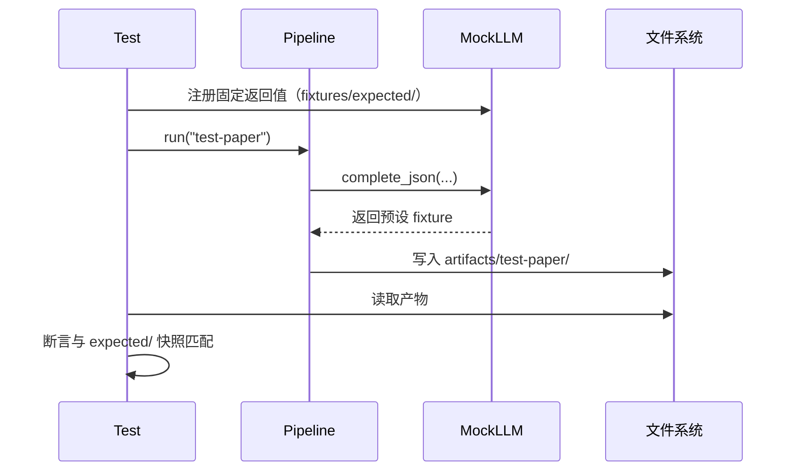


**快照测试**：`expected/` 目录保存期望的 artifact 内容，用于检测 Prompt 修改导致的输出变化是否符合预期（类似前端的 snapshot test）。

**E2E 测试**：使用真实小论文（~5 页），调用真实 LLM API，验证端到端流程不报错、产物结构合法。仅在 `CI_E2E=true` 时运行。

---

## 九、可维护性设计

### 9.1 Prompt 与代码完全解耦

所有 Prompt 存放在 `prompts/` 目录的独立文件中，生成器代码只负责加载 Prompt、填充变量、调用 API。**修改 Prompt 不需要改代码**，也不会触发代码层的测试失败。

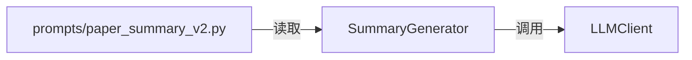


### 9.2 LLM 可替换

通过 `LLMClient` 抽象层隔离模型调用。当前已实现 OpenAI-compatible 客户端，可通过 `.env` 中的 `API_KEY`、`BASE_URL`、`MODEL_NAME` 切换 OpenAI、DeepSeek 或兼容网关；Claude 等非 OpenAI-compatible 客户端仍属于规划。

### 9.3 Discovery 配置

发现层沿用 `core/config.py: Settings` 和 `.env`，不另起配置系统。Paper2Search 新增 `ARXIV_MIN_INTERVAL`、`SEARCH_MAX_RESULTS`、`FETCH_DOWNLOAD_TIMEOUT_SECONDS`；Paper2Recommend 新增 `ZOTERO_ID`、`ZOTERO_KEY`、`ZOTERO_LIBRARY_TYPE`、`ZOTERO_IGNORE`、`ARXIV_QUERY`、`MAX_PAPER_NUM`、`RECOMMEND_CANDIDATE_POOL_SIZE`、`RECOMMEND_EMBEDDING_MODEL`。`ZOTERO_ID` 会归一化纯数字 ID、`users/...` 和 `groups/...` URL 片段。

### 9.4 幂等设计

当前 Layer 1 写操作采用显式覆盖策略：`paper-wiki assets` 默认拒绝覆盖已有 assets，只有传入 `--overwrite` 时才重写 assets；`paper-wiki ingest` 默认拒绝覆盖已有语义产物，但会复用已存在的 assets，只有传入 `--overwrite` 时才重建 assets 并重写所选语义产物。`ingest-all` 默认通过所选 Layer 1 文件是否存在来跳过已处理论文，传入 `--overwrite` 时会把所有 raw 论文送入同一条 pipeline 重跑。后续重建索引应先清空目标 ChromaDB collection 再重新索引，保证失败后可以安全重试。

### 9.5 渐进式引入

系统各层相互独立，可以分阶段上线：

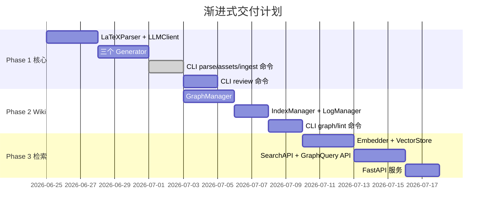


### 9.6 日志与可观测性

- 所有 LLM 调用记录：模型名、token 用量、耗时、成本估算（写入 `wiki/log.md`）
- 所有失败的 JSON 解析记录原始 LLM 响应（写入 `logs/llm_errors/`），便于 Prompt 调试
- `paper-wiki status` 命令可实时查看库的健康状态

---

## 十、待决策事项（留 Review 时讨论）


| 问题           | 选项 A                              | 选项 B                    | 建议                        |
| ------------ | --------------------------------- | ----------------------- | ------------------------- |
| LaTeX 截取策略   | 章节感知（取 Intro+Method+Related Work） |                         | 选 A，信息密度更高                |
| RAG 检索粒度     | H2 章节级（~300 tokens）               | 整篇 summary（~800 tokens） | 先做 H2 章节级，实测再调            |
| 概念页触发阈值      | ≥2 篇论文涉及时自动创建                     | 手动触发                    | 先手动触发，避免低质量自动创建           |
| Embedding 方案 | OpenAI `text-embedding-3-small`   | 本地 `bge-m3`             | 先用 OpenAI，有隐私需求再换本地       |


---
