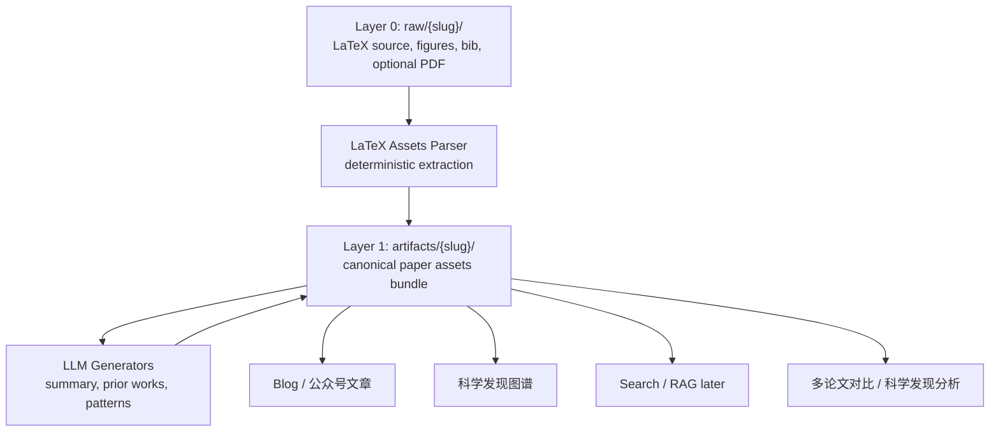
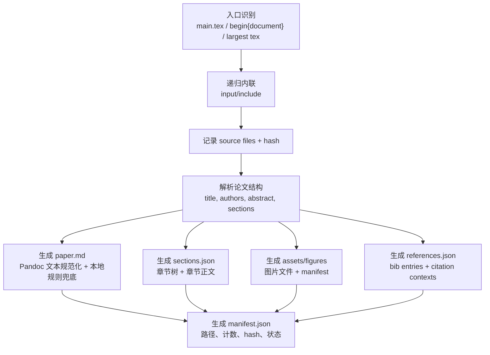
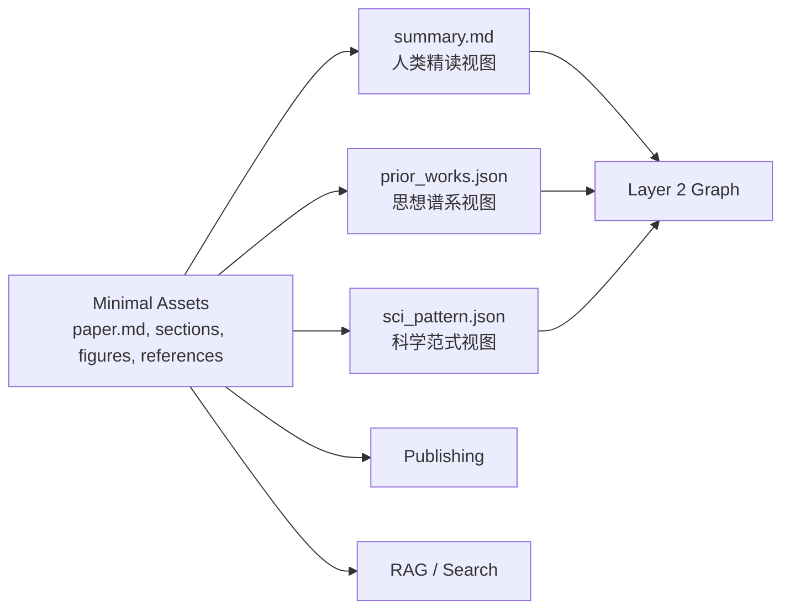

# Paper Assets 需求与设计方案

> 版本：v0.2 | 创建：2026-07-13 | 最后更新：2026-07-13 | 状态：最小 contract 已实现，持续维护

---

## 一、背景与目标

Paper-Wiki 当前已经能从 `raw/{paper-slug}/` 中的 LaTeX 源文件生成 Layer 1 最小 assets bundle，并在其下游生成三个独立语义产物：

- `manifest.json`
- `assets/paper.md`
- `assets/sections.json`
- `assets/figures/manifest.json` + 图片文件
- `assets/references.json`
- `summary.md`
- `prior_works.json`
- `sci_pattern.json`

`summary.md`、`prior_works.json`、`sci_pattern.json` 分别服务人类阅读、前作关系审查和科学范式分析；assets bundle 则是更底层、可复用、可校验的 deterministic 论文资产层。后续生成博客、公众号文章、科学发现图谱、RAG 索引、实验结果卡片或多篇论文对比时，不应让每个下游流程都重新解析 LaTeX。

因此需要引入一个明确的 **Paper Assets Contract**：

> 每篇论文先做 deterministic LaTeX 解析与结构化抽取，形成一个可复用、可校验、可移动的 assets bundle；`summary.md`、`prior_works.json`、`sci_pattern.json` 都是该 bundle 的下游消费者。

---

## 二、设计原则


| 原则         | 说明                                                             |
| ---------- | -------------------------------------------------------------- |
| 一次解析，多处复用  | LaTeX 源文件只在 ingest/assets 阶段解析一次，下游读取结构化 assets                |
| raw 只读     | 不复制、不修改 `raw/{slug}/` 中的原始论文文件，只记录路径和 hash                     |
| Layer 边界清晰 | assets 仍属于 Layer 1，只写入 `artifacts/{slug}/`，不更新 `wiki/`、图谱或检索索引 |
| 证据可追溯      | 重要抽取结果尽量能追溯到 LaTeX 文件、章节、figure 或 citation                     |
| 人机双友好      | 既保留 `summary.md` 这种人类可读视图，也提供 Markdown/JSON 机器可消费结构            |
| 下游无关       | assets 不绑定公众号、博客、图谱、RAG 等任一具体下游                                |
| 可渐进实现      | 先实现 deterministic LaTeX 解析资产，后续只按明确需求增强                        |


---


## 三、整体架构




核心变化是：稳定、可复用的结构化结果已经落盘为 `assets/`，成为三个语义产物和其他下游步骤的共同输入。当前架构中，下游不再依赖临时 `ParsedPaper` 适配对象，而是统一读取 `PaperAssetsBundle`。

---


## 四、推荐目录结构

每篇论文的全部 Layer 1 产物位于 `artifacts/{paper-slug}/`。顶层保留独立语义产物和 `manifest.json`，`assets/` 只放真正需要复用的最小 deterministic 资产。

这里采用 **非必要不新增** 原则：如果某个信息已经稳定存在于语义产物中，或者只服务单一下游，就不新增独立资产文件。

```text
artifacts/{paper-slug}/
├── manifest.json
├── summary.md
├── prior_works.json
├── sci_pattern.json
└── assets/
    ├── paper.md
    ├── sections.json
    ├── figures/
    │   ├── manifest.json
    │   └── ...
    └── references.json
```


### 顶层文件职责


| 文件                       | 状态  | 职责                                             |
| ------------------------ | --- | ---------------------------------------------- |
| `manifest.json`          | 已实现 | bundle 索引、版本、路径、计数、hash、生成状态                   |
| `summary.md`             | 已有  | 人类阅读视图，只保留正文，不维护 YAML frontmatter 或论文元信息；可在文末附加由 JSON 语义产物派生的补充区块 |
| `prior_works.json`       | 已有  | 当前论文与直接前作的关系视图                                 |
| `sci_pattern.json`       | 已有  | 当前论文科学创新范式视图                                   |
| `assets/paper.md`        | 已实现 | 规范化后的论文主文，供 LLM 和人类 debug 复用                   |
| `assets/sections.json`   | 已实现 | 章节树和核心章节内容，避免下游重复切 LaTeX                       |
| `assets/figures/`        | 已实现 | 从 LaTeX 图片资源抽取出的可复用图片目录，含图片文件和轻量 manifest      |
| `assets/references.json` | 已实现 | bib/citation 基础信息，支撑前作候选和思想溯源                  |


---


## 五、从 LaTeX 中落成哪些 Assets

这是本文档最重要的设计点。LaTeX 不只是正文文本，它天然包含论文结构、媒体引用、公式、表格、算法、引用关系和源文件位置。

但 assets 不是“把 LaTeX 中的一切都拆成文件”。当前阶段只落盘四类稳定资产：

1. 规范化主文：`assets/paper.md`
2. 章节结构：`assets/sections.json`
3. 相关图片：`assets/figures/`
4. 引用文献：`assets/references.json`

表格、公式、算法、claim、evidence、RAG chunk 等暂不单独落盘；它们保留在 `paper.md` / `sections.json` 的文本中，等出现明确下游需求后再拆。

### 5.1 抽取对象总览


| LaTeX 来源                          | 抽取结果               | 推荐落盘                                          | 用途                         |
| --------------------------------- | ------------------ | --------------------------------------------- | -------------------------- |
| `\title{}`                        | 标题                 | `manifest.json` 的 `paper.title` | 不新增 `paper.json`，避免元数据多头维护 |
| `\author{}` / conference template | 作者                 | `manifest.json` 的 `paper.authors` | 只保留一份主要人类可改入口              |
| `\begin{abstract}`                | 摘要                 | `assets/paper.md`, `assets/sections.json`     | summary、检索、快速预览            |
| `\section` / `\subsection`        | 章节树和章节正文           | `assets/sections.json`                        | 结构化阅读、LLM 输入、下游导航          |
| 普通段落                              | 规范化正文              | `assets/paper.md`, `assets/sections.json`     | 避免下游重复清洗 LaTeX             |
| `figure` / `includegraphics`      | 图片文件、caption、label | `assets/figures/`                             | blog、公众号、summary 插图        |
| `table` / `tabular`               | 保留为章节文本中的表格源码或文本表示 | `assets/paper.md`, `assets/sections.json`     | 当前不单独建 `tables.json`       |
| `equation` / `align` / `\[...\]`  | 保留为章节文本中的 LaTeX 公式 | `assets/paper.md`, `assets/sections.json`     | 当前不单独建 `equations.json`    |
| `algorithm` / `algorithmic`       | 保留为章节文本中的算法块       | `assets/paper.md`, `assets/sections.json`     | 当前不单独建 `algorithms.json`   |
| `\cite{}`                         | cite key 和出现章节     | `assets/references.json`                      | 前作候选、思想溯源                  |
| `.bib` / `.bbl` 条目                | 文献元数据              | `assets/references.json`                      | 前作候选、图谱外部节点                |
| 源文件路径和 hash                       | provenance         | `manifest.json`                               | 判断 assets 是否过期             |


### 5.2 LaTeX 到 Assets 的抽取流程



当前实现采用混合策略：Pandoc 只处理普通 LaTeX 正文到 Markdown 的转换，改善段落、列表、引用和行内样式；图片抽取、PDF 图片渲染、reference 结构化、source provenance 仍由 assets builder 自己控制。复杂表格、算法、prompt、代码块优先保留为 fenced LaTeX block，而不是强行转成 Markdown 表格，避免复杂论文宏造成信息丢失。


### 5.3 抽取优先级

第一阶段只做 deterministic 资产，减少 LLM 幻觉风险：


| 优先级 | Assets                                             | 原因                                        |
| --- | -------------------------------------------------- | ----------------------------------------- |
| 必须  | `manifest.json`                                    | bundle 入口，记录路径、计数、源文件 hash                |
| 必须  | `assets/paper.md`                                  | 下游最常用的规范化论文文本                             |
| 必须  | `assets/sections.json`                             | 比纯文本多一点结构，但不细拆到 block                     |
| 必须  | `assets/figures/`                                  | 图片是博客、公众号、summary 的共同依赖                   |
| 必须  | `assets/references.json`                           | prior works 与图谱的共同候选来源                    |
| 暂不做 | `blocks.jsonl`, `chunks.jsonl`                     | RAG 粒度未定，过早固化会增加迁移成本                      |
| 暂不做 | `tables.json`, `equations.json`, `algorithms.json` | 先保留在章节文本中，等有表格/公式/算法检索需求再拆                |
| 暂不做 | `claims.json`, `evidence.json`, `experiments.json` | 属于 LLM 语义提炼，不是 LaTeX deterministic assets |


---


## 六、核心 Assets Schema

以下 schema 对齐当前已实现的 Pydantic 模型。字段仍可随后续需求演进，但变更时需要同步更新模型、测试和本文档。

注意：`AssetFileIndex` 只描述 deterministic assets 文件；`summary`、`prior_works`、`sci_pattern` 是 assets 的下游产物，不属于 `manifest.files`。

### 6.1 `manifest.json`

`manifest.json` 是 bundle 的入口索引，同时承担 source/provenance 职责。这样可以避免再新增 `source.json`。

```json
{
  "schema_version": "paper-wiki-assets-v1",
  "slug": "GraphWalker",
  "created_at": "2026-07-13T10:00:00+08:00",
  "updated_at": "2026-07-13T10:00:00+08:00",
  "paper": {
    "title": "GraphWalker: ...",
    "authors": ["Alice Zhang", "Bob Li"],
    "abstract": "Parser-extracted abstract text."
  },
  "source": {
    "raw_dir": "raw/GraphWalker",
    "entry_file": "main.tex",
    "source_files": [
      {
        "path": "main.tex",
        "sha256": "...",
        "bytes": 12345
      },
      {
        "path": "sections/method.tex",
        "sha256": "...",
        "bytes": 6789
      }
    ],
    "unresolved_inputs": []
  },
  "files": {
    "paper_text": "assets/paper.md",
    "sections": "assets/sections.json",
    "figures": "assets/figures/manifest.json",
    "references": "assets/references.json"
  },
  "counts": {
    "sections": 8,
    "figures": 6,
    "references": 42
  },
  "parser": {
    "name": "paper-wiki-latex-parser",
    "version": "v1"
  },
  "warnings": []
}
```

`manifest.paper` 是论文级元信息与人工审查状态的唯一维护入口。parser 会先写入可自动抽取的草稿元数据，人工审查时在这里补齐或修正 year、venue、arXiv ID、tags、contribution type 和 `reviewed`。

### 6.2 `assets/paper.md`

`paper.md` 是规范化后的论文主文，目标是给 LLM、人工检查和后续转换提供一个稳定文本入口。

建议保留：

- title / authors / abstract
- section / subsection 标题
- 正文段落
- 公式 LaTeX
- 算法环境的文本表示
- figure 占位符和 caption
- table/tabular 文本表示
- citation key

示例：

```markdown
# GraphWalker: ...

Authors: Alice Zhang; Bob Li

## Abstract

...

## Method

We propose ...

$$
\mathcal{L}=...
$$

[Figure: fig:overview | figures/overview.jpg]
Overview of the proposed GraphWalker framework.
```


### 6.3 `assets/sections.json`

`sections.json` 保留章节层级和章节正文。它比 `paper.md` 多结构，但不细拆到 paragraph/block 级别。

```json
{
  "sections": [
    {
      "id": "sec-abstract",
      "type": "abstract",
      "title": "Abstract",
      "level": 0,
      "text": "..."
    },
    {
      "id": "sec-method",
      "type": "section",
      "title": "Method",
      "level": 1,
      "source": {
        "file": "sections/method.tex",
        "line_start": 1,
        "line_end": 180
      },
      "text": "We propose ...",
      "labels": ["fig:overview", "eq:objective"],
      "citations": ["vaswani2017attention"]
    }
  ]
}
```


### 6.4 `assets/figures/`

`assets/figures/` 是图片资源目录。LaTeX 中的 `figure` / `includegraphics` 会被解析为可复用图片文件；`.pdf` / `.eps` 等不适合直接在 Markdown/HTML 中展示的格式，建议在抽取阶段渲染为 `.jpg` 或 `.png`。

目录结构：

```text
assets/figures/
├── manifest.json
├── overview.jpg
└── ablation.jpg
```

`manifest.json` 记录图片和原始 LaTeX figure 的对应关系：

```json
{
  "figures": [
    {
      "id": "fig-overview",
      "label": "fig:overview",
      "caption": "Overview of the proposed GraphWalker framework.",
      "source_path": "raw/GraphWalker/figures/overview.pdf",
      "asset_path": "assets/figures/overview.jpg",
      "section_id": "sec-method"
    }
  ]
}
```


### 6.5 `assets/references.json`

`.bib` / `.bbl` 文件是 prior works 的强信号来源。即使 LLM 负责判断哪些是“直接前作”，候选集合也应来自 structured references。

```json
{
  "references": [
    {
      "key": "vaswani2017attention",
      "title": "Attention Is All You Need",
      "authors": ["Ashish Vaswani", "Noam Shazeer"],
      "year": 2017,
      "venue": "NeurIPS",
      "doi": "",
      "arxiv_id": "1706.03762",
      "url": "https://arxiv.org/abs/1706.03762",
      "raw_bibtex": "@inproceedings{...}",
      "citation_contexts": [
        {
          "section_id": "sec-related",
          "text": "Transformer-based methods have become ..."
        }
      ]
    }
  ]
}
```

---


## 七、Assets 与下游语义产物的关系

在这个方案中，`summary.md`、`prior_works.json`、`sci_pattern.json` 都是 assets 的下游消费者。assets 本身只负责从 LaTeX 中抽取通用资源，不负责完成摘要、前作判断或范式分类。




| 产物                       | 读取对象                               | 是否人工审查  | 主要消费者                      |
| ------------------------ | ---------------------------------- | ------- | -------------------------- |
| `assets/paper.md`        | LaTeX deterministic parse          | 通常不逐段审查 | LLM 输入、人工 debug            |
| `assets/sections.json`   | LaTeX deterministic parse          | 通常不逐段审查 | summary、prior works、RAG 预备 |
| `assets/figures/`        | LaTeX figure/includegraphics parse | 可抽查     | 博客、公众号、summary             |
| `assets/references.json` | LaTeX + bib/bbl parse              | 可抽查     | prior works、图谱候选           |
| `summary.md`             | assets + LLM                       | 需要审查    | 人类阅读、图谱入库门槛                |
| `prior_works.json`       | references + sections + LLM        | 需要审查    | 科学发现图谱                     |
| `sci_pattern.json`       | sections + LLM                     | 需要审查    | 科学范式分析                     |


---


## 八、下游复用方式

### 8.0 Summary 语义补充

`summary.md` 的主体仍由 Summary Generator 生成，且不承载论文元信息。为了提升单文档阅读密度，pipeline 会在新生成 summary 后做一次 deterministic 后处理：

- 从 `sci_pattern.json` 读取主要/次要科学发现范式和分类理由
- 从 `prior_works.json` 读取 `synthesis_narrative`
- 追加到 `summary.md` 末尾的 `## 科学发现范式` 与 `## 先前工作分析` 区块

这个后处理只消费已经生成或已有的 JSON 语义产物，不让 Summary Generator 直接依赖 Prior Works Generator 或 Pattern Generator；当某个 JSON 不存在或不可读时，对应小节会被跳过。


### 8.1 Blog / 公众号

下游不再从 `raw/` 找图，也不再重新解析 caption：

- 从 `summary.md` 组织叙事
- 从 `assets/figures/manifest.json` 选图片和 caption
- 从 `assets/sections.json` 查找原文上下文
- 从 `manifest.json` 定位所有文件


### 8.2 科学发现图谱

图谱构建仍以 reviewed Layer 1 语义产物为准，但可以利用 assets 提升质量：

- `references.json` 提供候选前作全集
- `references.json` 中的 `citation_contexts` 提供引用上下文
- `sections.json` 提供关系描述的原文上下文
- `manifest.json` 的 `paper` 字段继续作为主论文元数据和 review 状态入口


### 8.3 RAG / 检索

当前不在 Layer 1 生成 `chunks.jsonl`。后续 Layer 3 如需 RAG，可从 `sections.json` 再派生 chunk，避免过早固化索引粒度。

---


## 九、实现阶段建议


### Phase A：Deterministic Assets MVP（已实现）

目标：不增加 LLM 复杂度，先把 LaTeX 结构稳定落盘。

交付：

- `manifest.json`
- `assets/paper.md`
- `assets/sections.json`
- `assets/figures/`
- `assets/references.json`


### Phase B：Pipeline 改造

状态：已实现；三个语义产物的主链路已经切换为 `PaperAssetsBundle` canonical input，并支持单步重跑。

目标：让现有语义产物从 canonical assets 读取输入，而不是直接消费或适配临时 `ParsedPaper`。

已交付：

- `paper-wiki assets <slug...> [--overwrite]` 可单独构建 assets，不调用 LLM，不生成语义产物
- `ingest` 在生成语义产物前先构建或复用 assets
- `AssetsReader.load(slug)` 返回 `PaperAssetsBundle`
- 当前三个 generator 直接消费 `PaperAssetsBundle`，互不读取彼此产物
- `PaperAssetsBuilder.load_parsed()`、`AssetsBuildResult.parsed`、generator 对 `ParsedPaper.raw_text` 的依赖已经移除
- `ingest` 仍只写入 `artifacts/{slug}/`，不更新 `wiki/`、图谱、embedding 或检索索引
- 单步骤重跑 `--only summary|prior_works|sci_pattern` 已实现；CLI 也接受 `prior-works`、`pattern` 别名

待交付：

- 正式人工 review 命令


### Phase C：按需增强

目标：只有当某类信息被两个以上下游稳定依赖时，才新增独立 assets。

候选但暂不实现：

- `chunks.jsonl`
- `equations.json`
- `algorithms.json`
- `claims.json`
- `evidence.json`

---


## 十、待讨论问题


| 问题                     | 如何做？                                                   |
| ---------------------- | ------------------------------------------------------ |
| 是否新增 `paper.json`      | 不新增，`manifest.json` 维护元数据                              |
| 是否保存完整 `paper.md`      | 保存，方便人类 debug 和 LLM prompt 复用                          |
| 是否需要 `blocks.jsonl`    | 不需要；先用 section 粒度，避免过早设计 RAG 粒度                        |
| 是否渲染所有 LaTeX 图片        | MVP 可只记录路径；公众号/HTML 需求强时再渲染                            |
| 是否解析 `.bbl`            | 若 `.bib` 不存在，应支持 `.bbl` 回退                             |
| 是否把 appendix 纳入 assets | 默认纳入 `paper.md` 和 `sections.json`                      |
| 是否新增 LLM 语义 assets     | 不新增；优先复用现有独立语义产物                                      |
| assets 是否允许人工修改        | deterministic assets 不建议手改；人工修改应发生在语义产物或 review patch 中 |


---


## 十一、与当前实现边界的关系

当前已实现行为是：

- `paper-wiki parse <slug>`：解析 LaTeX 并打印摘要，不调用 LLM
- `paper-wiki assets <slug...> [--overwrite]`：只构建 deterministic assets，不调用 LLM
- `paper-wiki ingest <slug...> [--overwrite]`：先构建或复用 assets，再生成 `summary.md`、`prior_works.json`、`sci_pattern.json`
- assets 和 ingest 只写入 `artifacts/{slug}/`
- 不更新 `wiki/`、图谱、embedding 或检索索引

后续如增强本文档中的 assets contract，应同步更新：

- `docs/Paper-Wiki 需求文档.md`
- `docs/Paper-Wiki 技术方案_v1.md`
- Pydantic models
- parser / pipeline tests
- README 中的 artifact 目录说明
