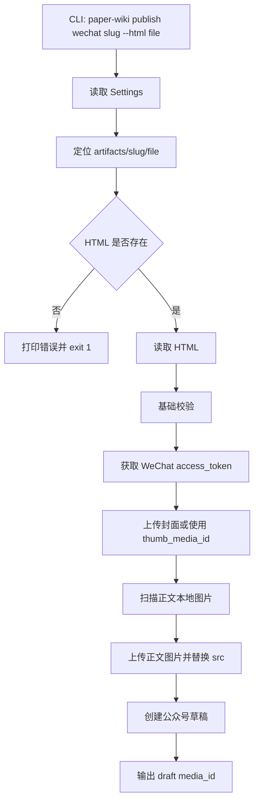

# Paper-Wiki 微信公众号 HTML 发布需求与技术方案

> 创建：2026-07-11 | 最后更新：2026-07-15 | 状态：一至十一节已实现；十二节起为 v2 新增草案 | 范围：Layer 1 artifact 的外部发布能力

---

## 一、背景与目标

Paper-Wiki 当前已能在 `artifacts/{paper-slug}/` 下生成和维护单篇论文的 Layer 1 产物。下一步希望把其中已经排版好的 HTML 内容发布到微信公众号，典型输入路径类似：

```text
artifacts/GraphWalker/article.html
```

本需求的目标不是改变 Layer 0/Layer 1 的 ingest 逻辑，而是在其后增加一个独立的“发布到外部渠道”能力：

- 用户通过 CLI 指定论文 slug 和 HTML 文件名。
- 系统读取 `artifacts/{slug}/` 下的 HTML。
- 若目标 HTML 不存在，CLI 返回清晰错误并以非 0 状态退出。
- 若配置完整，系统将 HTML 创建为微信公众号草稿，供人工检查后在公众号后台发布。

本设计将“发布”默认定义为“创建微信公众号草稿”。真正的群发或发布接口涉及账号认证、内容合规与人工确认，建议作为后续显式功能，不在首版默认自动执行。

---

## 二、参考仓库迁移结论

参考仓库：`Szy5/VibeIDEA`

已确认可复用的设计点：

| 参考位置 | 可迁移点 | Paper-Wiki 中的调整 |
| --- | --- | --- |
| `backend/construct_wechat.py` | 公众号正文应返回 body 片段，不应包含完整 `html/head/style` 文档壳 | Paper-Wiki 已经有现成 HTML，因此不负责重新渲染，只做读取、校验和必要的图片 URL 替换 |
| `backend/construct_wechat.py` | 所有样式应尽量使用 inline style，避免复杂 CSS | 首版增加轻量校验：拒绝明显不适合公众号 API 的 `<script>`、外部 CSS、空正文等 |
| `backend/main.py` | 微信能力从主流程中独立：初始化 client、上传图片、渲染内容、创建草稿 | 在 Paper-Wiki 中拆成 `publishing/` 包，不混入 `ingestion/` 或 `graph/` |
| `backend/main.py` | 图片需要先上传到微信，再把正文中的图片引用换成微信可访问 URL | Paper-Wiki 首版支持扫描本地 ``，上传后替换为微信图床 URL；远程 URL 可配置为保留或跳过 |
| `wechat_publisher.WechatClient` | 用 client 封装 token、图片上传、草稿创建 | 参考接口形态，但建议在本项目内实现一个小型 `WeChatClient`，减少对未锁定外部包的隐式依赖 |

参考仓库没有把通用“任意 HTML 文件发布到公众号”的能力抽象成 SDK，因此不能直接照搬文件；更适合迁移它的工程边界和 API 调用流程。

---

## 三、需求描述

### 3.1 功能需求

| 编号 | 需求 | 说明 |
| --- | --- | --- |
| R-WC-1 | 按论文 slug 定位 artifact 目录 | 从全局配置的 `artifacts_dir` 解析 `artifacts/{slug}/` |
| R-WC-2 | 按参数读取指定 HTML | CLI 必须支持指定 HTML 文件名或相对路径，如 `--html article.html` |
| R-WC-3 | 缺失文件时返回错误 | 若 `artifacts/{slug}/` 或目标 HTML 不存在，输出明确错误并 `exit code = 1` |
| R-WC-4 | 创建微信公众号草稿 | 使用 AppID/AppSecret 获取 token，上传封面图，调用草稿接口创建图文草稿 |
| R-WC-5 | 支持正文本地图片上传 | 将 HTML 中本地图片上传为公众号正文图片，并替换 `src` |
| R-WC-6 | 支持标题、作者、摘要传参 | CLI 参数覆盖 `.env` 默认值，便于单篇文章定制 |
| R-WC-7 | 不修改 artifact 原文件 | 默认不覆盖源 HTML；若需要调试，可通过 `--save-rendered` 另存处理后的 HTML |
| R-WC-8 | 结果可追踪 | 成功后输出草稿 `media_id`、标题、源 HTML 路径；可选写入发布记录 JSONL |

### 3.2 非功能需求

| 类型 | 要求 |
| --- | --- |
| 可维护性 | 发布能力放在独立 `paper_wiki.publishing` 包内，CLI 只做参数解析和错误呈现 |
| 安全性 | AppSecret 只从 `.env` 或环境变量读取，不打印、不写入日志 |
| 可测试性 | 文件定位、HTML 校验、图片替换、client 请求 payload 均可用 mock 测试 |
| 边界清晰 | 不让 publish 命令触发 ingest、graph plan、wiki 更新或 retrieval 更新 |
| 可恢复性 | 图片上传和草稿创建失败时返回清晰错误；源文件保持不变 |

### 3.3 首版不做

- 不自动调用群发或发布接口。
- 不把 Markdown 转公众号 HTML；本需求假设 HTML 已经存在。
- 不自动生成封面图。
- 不维护 `wiki/`、embedding、检索索引。
- 不把微信 token 持久化到仓库文件；如需缓存，应放到本地临时缓存或后续专门设计。

---

## 四、CLI 设计

推荐新增 `publish` 命令组：

```bash
paper-wiki publish wechat GraphWalker --html article.html --title "GraphWalker 论文精读"
```

完整参数建议：

```bash
paper-wiki publish wechat <slug> \
  --html article.html \
  --title "GraphWalker 论文精读" \
  --author "Paper-Wiki" \
  --digest "GraphWalker 论文精读摘要" \
  --cover artifacts/GraphWalker/cover.jpg \
  --save-rendered
```

参数说明：

| 参数 | 必填 | 默认值 | 说明 |
| --- | --- | --- | --- |
| `slug` | 是 | 无 | `artifacts/{slug}/` 的目录名 |
| `--html` | 是 | 无 | artifact 目录下的 HTML 文件名或相对路径 |
| `--title` | 否 | HTML 文件名或 frontmatter/metadata 推断 | 微信草稿标题 |
| `--author` | 否 | `WECHAT_AUTHOR` | 作者名 |
| `--digest` | 否 | 空 | 图文摘要 |
| `--cover` | 否 | `WECHAT_COVER_PATH` | 封面图路径；相对路径优先按项目根解析 |
| `--thumb-media-id` | 否 | `WECHAT_THUMB_MEDIA_ID` | 已上传的封面素材 ID；传入后可跳过封面上传 |
| `--save-rendered` | 否 | `False` | 将图片替换后的 HTML 保存到 `artifacts/{slug}/{原文件名}_wechat_rendered.html` |
| `--verbose` | 否 | `False` | 输出调试日志，但不得打印 secret |

错误示例：

```text
ERROR: artifact directory does not exist: artifacts/GraphWalker
ERROR: HTML file does not exist under artifacts/GraphWalker: article.html
ERROR: WeChat credentials are missing: WECHAT_APPID and WECHAT_SECRET
ERROR: cover image or thumb_media_id is required to create a WeChat draft
```

---

## 五、配置设计

在 `core.config.Settings` 中新增微信相关配置，继续使用 pydantic-settings 从 `.env` 和环境变量读取：

| 字段 | 环境变量 | 说明 |
| --- | --- | --- |
| `wechat_appid` | `WECHAT_APPID` | 公众号 AppID |
| `wechat_secret` | `WECHAT_SECRET`, `WECHAT_APPSECRET` | 公众号 AppSecret |
| `wechat_author` | `WECHAT_AUTHOR` | 默认作者 |
| `wechat_cover_path` | `WECHAT_COVER_PATH` | 默认封面图路径 |
| `wechat_thumb_media_id` | `WECHAT_THUMB_MEDIA_ID` | 已上传封面素材 ID |
| `wechat_request_timeout_seconds` | `WECHAT_REQUEST_TIMEOUT_SECONDS` | 微信 API 超时时间 |

注意事项：

- `.env` 不应提交到仓库。
- 日志中禁止输出 `WECHAT_SECRET`、`access_token`。
- 如本机或服务器出口 IP 未加入公众号后台白名单，微信 API 可能返回权限错误；这属于运行环境问题，应在错误信息中提示用户检查公众号后台配置。

---

## 六、包结构设计

建议新增包：

```text
src/paper_wiki/publishing/
├── __init__.py
├── artifact_html.py       # 定位和读取 artifacts/{slug}/ 下的 HTML
├── html_processor.py      # HTML 基础校验、本地图片发现与 src 替换
├── models.py              # WeChatDraftOptions、WeChatDraftResult 等 Pydantic 模型
├── wechat_client.py       # 微信 API client：token、图片上传、草稿创建
└── wechat_publisher.py    # 编排：读取 HTML -> 处理图片 -> 创建草稿
```

CLI 只依赖 `wechat_publisher.py`，不直接拼微信请求。

### 6.1 模块职责

| 模块 | 职责 |
| --- | --- |
| `artifact_html.py` | 解析 `artifacts_dir / slug / html_path`，防止路径逃逸，读取 UTF-8 HTML |
| `html_processor.py` | 校验 HTML、扫描本地图片、上传后替换 `src`、可选保存 rendered HTML |
| `models.py` | 定义输入输出模型，用 Pydantic 约束 title、digest、路径等字段 |
| `wechat_client.py` | 封装 `requests` 调用，统一处理微信错误码 |
| `wechat_publisher.py` | 对外提供 `publish_artifact_html_to_wechat(options)` |

### 6.2 依赖建议

`requirements.txt` / `pyproject.toml` 需要新增：

```text
requests>=2.32.0
beautifulsoup4>=4.12.0
```

若希望避免 HTML 解析依赖，也可以先使用 Python 标准库 `html.parser`，但图片替换与容错性会更差。考虑后续维护，建议使用 `beautifulsoup4`。

---

## 七、发布流程



### 7.1 HTML 校验策略

首版做保守校验，目标是尽早发现明显错误，而不是实现完整微信编辑器兼容性检查：

- 文件必须存在且扩展名建议为 `.html` 或 `.htm`。
- 内容不能为空。
- 不允许出现 `<script>`。
- 对 `<style>`、外部 CSS、`position: fixed/absolute/sticky` 等给出 warning 或 error，具体严格度可通过 `--strict-html` 后续扩展。
- 若包含本地图片，图片必须存在且格式为 `jpg/jpeg/png/gif` 中微信接口可接受的格式。

如果项目后续接入公众号排版引擎，可以复用其更严格的 HTML 校验器，但本需求不强制要求 HTML 必须由该引擎生成。

### 7.2 图片处理策略

微信公众号正文中的本地图片不能直接引用本地路径。处理规则：

| 图片类型 | 首版行为 |
| --- | --- |
| `src="figure.png"` | 按 HTML 所在目录解析，上传后替换 |
| `src="./figure.png"` | 按 HTML 所在目录解析，上传后替换 |
| `src="/abs/path/figure.png"` | 允许读取本机绝对路径，但需确认在项目内或后续加开关 |
| `src="https://..."` | 默认保留，不上传 |
| `src="data:image/..."` | 首版拒绝，提示先落盘为图片文件 |

上传正文图片应使用微信“图文消息内图片”接口，返回 URL 后替换到 HTML 中。封面图则走永久素材或复用 `thumb_media_id`，两者不要混用。

---

## 八、错误处理与返回值

### 8.1 本地错误

本地错误在发起微信 API 前尽早失败：

- artifact 目录不存在。
- HTML 文件不存在。
- HTML 文件路径试图逃逸出 `artifacts/{slug}/`。
- HTML 为空或含禁止标签。
- 封面图不存在，且未提供 `thumb_media_id`。
- 微信凭证缺失。

### 8.2 微信 API 错误

`wechat_client.py` 统一把微信返回包装成项目内异常，例如：

```text
WeChatAPIError(code=40013, message="invalid appid")
WeChatAPIError(code=40164, message="invalid ip")
WeChatAPIError(code=48001, message="api unauthorized")
```

CLI 展示时不输出请求 URL 中的 `access_token`，只输出错误码、错误摘要和建议排查方向。

---

## 九、测试计划

| 测试类型 | 用例 |
| --- | --- |
| 单元测试 | `resolve_artifact_html` 能正确解析存在的 HTML |
| 单元测试 | 缺失 artifact 目录返回 `FileNotFoundError` 或领域异常 |
| 单元测试 | 缺失 HTML 返回明确错误 |
| 单元测试 | `../outside.html` 这类路径逃逸被拒绝 |
| 单元测试 | HTML 中本地图片 src 能被替换为 mock 上传 URL |
| 单元测试 | `<script>` 被校验器拒绝 |
| 单元测试 | `WeChatClient.create_draft` 生成 payload 符合预期 |
| CLI 测试 | `paper-wiki publish wechat GraphWalker --html missing.html` 退出码为 1 |
| CLI 测试 | mock publisher 成功时输出草稿 media_id |

真实微信 API smoke test 不应默认运行；需要显式环境变量开启，例如：

```bash
RUN_WECHAT_API_TESTS=1 pytest tests/integration/test_wechat_publish.py
```

---

## 十、实施步骤建议

1. 新增 `paper_wiki.publishing` 包和 Pydantic 模型。已完成。
2. 实现 artifact HTML 定位与路径安全检查。已完成。
3. 实现 HTML 基础校验与本地图片替换。已完成。
4. 实现 `WeChatClient`，支持 token、正文图片上传、封面素材上传、草稿创建。已完成。
5. 增加 `paper-wiki publish wechat` CLI。已完成。
6. 增加单元测试和 CLI mock 测试。已完成。
7. 更新长期维护文档：`Paper-Wiki 需求文档.md` 与 `Paper-Wiki 技术方案_v1.md`，把发布能力标为新增 Layer 1 downstream extension。已完成。

---

## 十一、待确认问题

| 问题 | 建议默认 |
| --- | --- |
| “发布”是否必须自动群发，而非只进草稿箱？ | 首版只进草稿箱，人工确认后发布 |
| HTML 文件名是否固定？ | 不固定，通过 `--html` 显式传参 |
| 是否允许没有封面图？ | 微信草稿通常需要封面素材，首版要求 `--cover` 或 `--thumb-media-id` |
| 是否要把发布记录写回 artifact 目录？ | 可选，默认只打印结果；后续可写 `wechat_publish_history.jsonl` |
| 是否要支持批量发布多个 slug？ | 首版单篇，批量可在 shell 或后续 CLI 中扩展 |

---

## 十二、v2 新增：Summary → Blog HTML 自动渲染（补上"HTML 从哪来"这个缺口）

> 状态：已实现并通过真实端到端验证 | 提出：2026-07-15 | 实现：2026-07-15

### 12.0 实施纪要（对照草案的落地情况）

- Cursor 无头模式的确切命令行拿到了真实可用的一条（用户本机验证过）：`agent -p --force --trust --workspace <project_root> --output-format text "<prompt>"`。这不是一个需要用户填 `.env` 模板的抽象配置项——12.5 节原方案里"命令模板化"的顾虑已经不需要了，直接把这个固定 flag 组合写死在 `cursor_render.py` 里，只把 `cursor_headless_binary`（默认 `"agent"`）和超时时间做成可配置。
- Cursor 的 headless agent **不会**把结果写到一个固定或可预测的文件名——真实跑下来观察到它至少有两种输出模式：直接复用 `summary.html`，或者按主题生成 `{stem}_排版_{theme}.html`。`render_blog_html()` 用"调用前后给目录下的 html 文件拍 mtime 快照、取变化的那些"来定位产物，不假设文件名。
- **真实测试中发现并修复了一个 bug**：Cursor 有时会在生成正式 HTML 的同时，额外写一个 `{name}_预览.html`——这是一个带完整 `<!DOCTYPE html>` 和一段 `<script>`（复制到剪贴板的 toast 提示）的本地预览壳，不是给公众号发布用的正文片段，而且这个预览文件在观察到的两次真实运行里都是**在正式文件之后**才写完。最初"取最近修改的那个"的启发式因此错误地选中了预览文件，导致 `validate_wechat_html` 正确地因为 `<script>` 标签拒绝了产物，任务报 `failed`。修复方式：候选文件先按文件名排除包含"预览"的，再按内容排除以 `<!doctype html`/`<html` 开头的完整页面壳，剩下的候选里取最新修改的一个。已经补了对应的回归测试，并针对同一篇论文（Search-Self-Play）用真实 Cursor 调用复现过修复前的失败和修复后的成功。
- 好消息：这次失败**没有破坏已有状态**——`render_blog_html()` 在校验失败时直接抛异常，`manifest.json` 的 `blog_html_generated_at`/`blog_html_path` 只在成功路径里才会被 `mark_blog_html_generated` 更新，所以一次失败的重新生成不会覆盖上一次成功生成的记录；即使磁盘上的目标文件被 Cursor 写坏了，六节已有的 `wechat_publisher` 在真正发布时也会重新跑一遍 `validate_wechat_html`，不会因为 manifest 里"曾经生成过"这个标记就信任当前文件内容。
- 真实调用耗时：两次全流程（CLI 一次、Web API 两次）实测都在 2 分 10 秒～2 分 55 秒之间，默认 300 秒超时留有余量。

### 12.1 背景与要补的缺口

第一节到第十一节解决的是"HTML 已经存在时，怎么发布到微信"，但明确写了"首版不做"：

> 不把 Markdown 转公众号 HTML；本需求假设 HTML 已经存在。（见 3.3 节）

现状是：`summary.md` 生成之后，"把 summary 排版成一篇带样式的博客 HTML"这一步，用户目前是手动做的——打开本地的 Cursor，交互式地跑一个排版 Skill（产物就是 `artifacts/GraphWalker/summary_v2_排版_摸鱼绿(moyu-green).html` 这类文件：文件名里的"摸鱼绿(moyu-green)"是 Skill 里挑的一个配色主题），生成好之后再回到 Paper-Wiki 网页，把文件名手填进 Publish 面板的输入框，点发送图标，才会走到第六节已实现的 `wechat_publisher` 流程。

这一轮要补的就是这个中间步骤：**让"生成博客 HTML"变成 Paper-Wiki 后端自己触发的一步（调用本机 Cursor 的无头/非交互模式），而不是手动开 Cursor**。用户的预期顺序是：

```
生成 summary.md（已自动化）
        ↓
生成 Blog HTML（本节要补的新能力——调用 Cursor 无头模式）
        ↓
发布博客 / 发到微信草稿箱（六～九节已实现）
```

### 12.2 模块归属

延续第六节定的边界——发布相关能力都放在 `paper_wiki.publishing` 包内，不混进 `ingestion/`：

```text
src/paper_wiki/publishing/
├── ...（六节已有文件不变）
└── cursor_render.py       # 新增：调用本机 Cursor 无头模式，把 summary.md 渲染成 blog.html
```

Web 层新增一个 job 触发端点，放在现有 `web/routers/publish.py` 里（同属"发布"这个领域，不必新开一个 router 文件）：

```
POST /api/papers/{slug}/blog/render-html
```

前端改动集中在 `PaperDetail.tsx` 现有的 Publish 侧栏面板，不涉及别的页面。

### 12.3 为什么必须做成异步 job

调用 Cursor 无头模式本质上是起一个子进程，这个子进程内部很可能还要再调一次 LLM 做排版决策，耗时是"秒级到几分钟"这个量级，跟现有的 `POST /{slug}/ingest`、`POST /papers/fetch` 是同一个数量级。所以**必须**复用现有 `JobManager` 异步任务模式（第四节"推荐 Feed 优化"文档里已经定的轮询进度模型），不能做成同步阻塞的 HTTP 请求：

```mermaid
flowchart TD
    A[前端点击"生成 HTML"] --> B[POST /papers/slug/blog/render-html]
    B --> C[JobManager.submit 起异步任务]
    C --> D[读取 artifacts/slug/summary.md]
    D --> E{summary.md 是否存在}
    E -- 否 --> F[任务失败，返回明确错误]
    E -- 是 --> G[拼装 Cursor 无头模式命令]
    G --> H[subprocess 调用，超时保护]
    H --> I{产物是否非空 HTML}
    I -- 否 --> F
    I -- 是 --> J[写入 artifacts/slug/blog.html]
    J --> K[manifest 记录 blog_html_generated_at]
    K --> L[job 状态 succeeded，前端轮询拿到 html_path]
    L --> M[Publish 面板自动填入 html_path，发布按钮可点]
```

### 12.4 `cursor_render.py` 设计

```python
class CursorRenderError(Exception):
    """summary.md 缺失 / Cursor 子进程失败 / 产物为空时抛出，语气对齐第八节的本地错误。"""


def render_blog_html(slug: str, settings: Settings, *, theme: str | None = None) -> Path:
    """读 artifacts/{slug}/summary.md，调用 Cursor 无头模式渲染，写回 artifacts/{slug}/blog.html。"""
```

内部步骤：

1. 定位并读取 `artifacts/{slug}/summary.md`；不存在则 `raise CursorRenderError("summary.md 不存在，请先生成摘要")`——对齐第八节"本地错误尽早失败"的原则。
2. 把 `summary.md` 内容和排版指令拼成一次调用的输入。**排版指令本身就是用户现在那个交互式 Cursor Skill 里的说明文字**，需要迁移成仓库里的一个 prompt 文件，建议新增 `prompts/blog_html_render_v1.py`，格式对齐现有 `prompts/paper_summary_v3.py` 的写法（`*_system_prompt` / `*_user_prompt` 两个字符串常量）。**这一步需要你把现在 Skill 里的排版规则原文搬过来**，我这边不替你编——排版细节（配色、字号、是否 inline style）你比我更清楚，硬编会跟你实际效果对不上。
3. 用 `subprocess.run(...)` 调用 Cursor 无头模式，命令行整体做成**可配置模板**而不是硬编码——见 12.5 节，原因是我目前没有把握 Cursor CLI 无头模式确切的参数形式，写死大概率会跟你本机版本对不上；模板化之后由你确认一次就行。
4. 设超时（默认 5 分钟，可配置），超时或子进程非 0 退出码都归为 `CursorRenderError`，把 stderr 摘要带进错误信息，但绝不打印 API key 之类的敏感变量。
5. 产物校验：非空、不包含 `<script>`（复用第七节 `html_processor.py` 已有的校验逻辑，不重复实现一遍）。
6. 写入 `artifacts/{slug}/blog.html`（固定文件名，`overwrite` 参数控制是否覆盖已有文件——**这一步顺带解决了现在"文件名靠手填、容易记错"的问题**：以后 Publish 面板永远认 `blog.html` 这个名字，不用户户再自己起名）。
7. 更新 `manifest.json` 里的 `blog_html_generated_at`（见 12.7 节），供前端判断"有没有生成过、生成于什么时候"。

### 12.5 配置设计（已加到 `core.config.Settings`）

| 字段 | 环境变量 | 默认值 | 说明 |
| --- | --- | --- | --- |
| `cursor_headless_binary` | `CURSOR_HEADLESS_BINARY` | `"agent"` | Cursor 无头模式可执行文件名/路径 |
| `cursor_headless_timeout_seconds` | `CURSOR_HEADLESS_TIMEOUT_SECONDS` | `300` | 子进程超时时间；真实调用实测 2 分 10 秒～2 分 55 秒，默认值留有余量 |
| `cursor_render_theme` | `CURSOR_RENDER_THEME` | `"摸鱼绿"` | 默认排版主题，`RenderBlogHtmlRequest.theme` 可覆盖 |
| `cursor_render_prompt_path` | `CURSOR_RENDER_PROMPT_PATH` | `"blog_html_render_v1.py"` | 排版指令 prompt 文件路径 |

固定的调用形状（用户本机验证过、`cursor_render.py` 里直接以参数列表方式调用，不走 shell 字符串拼接，避免转义问题）：

```python
[settings.cursor_headless_binary, "-p", "--force", "--trust",
 "--workspace", str(settings.project_root), "--output-format", "text", prompt]
```

草案原本担心"Cursor 无头模式参数不确定，不敢写死"，现在已经不是问题——用户给出的真实可用命令就是这个固定 flag 组合，不需要模板化成 `.env` 配置项；只把二进制名和超时时间留成配置，方便以后 Cursor CLI 升级换了可执行文件名时不用改代码。

### 12.6 API 契约（已实现）

`web/schemas/paper.py` 新增：

```python
class RenderBlogHtmlRequest(BaseModel):
    theme: str | None = None
```

`web/routers/publish.py` 新增端点：

```python
@router.post("/{slug}/blog/render-html", response_model=JobResponse, status_code=202)
def render_blog_html_endpoint(
    slug: str,
    payload: RenderBlogHtmlRequest,
    job_manager: JobManager = Depends(get_job_manager),
    repository: PaperRepository = Depends(get_paper_repository),
    settings: Settings = Depends(get_settings),
) -> JobResponse:
    clean_slug = validate_slug(slug)

    def task() -> dict[str, str]:
        html_path = render_blog_html(clean_slug, settings, theme=payload.theme)
        repository.mark_blog_html_generated(clean_slug, html_path.name)
        return {"slug": clean_slug, "html_path": html_path.name}

    job = job_manager.submit(slug=clean_slug, target="render_blog_html", task=task)
    return JobResponse.model_validate(job.model_dump())
```

`job.result.html_path` **不是**固定的 `"blog.html"`——草案最初假设可以固定文件名，但真实跑下来 Cursor 自己决定文件名（观察到 `summary.html` 和 `summary_排版_{theme}.html` 两种），所以这里如实返回 `render_blog_html()` 实际定位到的文件名，前端拿到什么就回填什么。

### 12.7 数据模型改动（已实现）

`assets/models.py: PaperAssetMeta` 新增两个字段（不是草案里的一个——因为文件名不固定，需要额外记一下实际产物叫什么）：

```python
class PaperAssetMeta(BaseModel):
    ...
    blog_html_path: str | None = None
    blog_html_generated_at: str | None = None  # ISO 时间戳，render_blog_html 成功后写入；None 表示还没生成过
```

`web/schemas/paper.py: PaperMetaDTO` 同步透出这两个字段。持久化没有复用 `update_meta`（那条路径要求调用方带 `expected_updated_at` 做乐观锁，但这是后台 job 跑完之后的系统写入，没有"用户手上的旧版本"这个概念），而是新增了 `PaperRepository.mark_blog_html_generated(slug, html_path)`，内部逻辑和 `_mutate_manifest` 一样加 `FileLock`，只是不做 `expected_updated_at` 相等性检查。

### 12.8 进度提示文案（已实现）

`web/services/progress_messages.py` 按草案加了两条规则，测下来展示效果符合预期：

| 匹配子串 | 展示文案 |
| --- | --- |
| `正在调用 Cursor 生成博客 HTML` | 🎨 正在排版博客 HTML... |
| `博客 HTML 生成完成` | ✅ 博客 HTML 生成完成 |

### 12.9 前端改动（已实现）

`PaperDetail.tsx` 的 Publish 面板：

1. 输入框上方新增"生成 HTML"按钮，点击调用 `renderBlogHtml(slug, theme)`（`client.ts` 新增），轮询逻辑跟 `regenerateSummary` 同构。
2. 轮询成功后用返回的实际 `html_path`（不是固定值）自动回填输入框，并展示"上次生成：{时间}"。
3. `detail.meta.blog_html_generated_at` 为空时，发送按钮 `disabled` 且 `title` 提示"请先生成 HTML"；一旦生成过就一直可点，不会锁死"生成过、只是想再发一次"的场景。

### 12.10 CLI（已实现，草案未列，补充记录）

`paper-wiki publish render-html <slug> [--theme ...]`：内部调用同一个 `render_blog_html()`，成功后同样调用 `PaperRepository.mark_blog_html_generated`，保证 CLI 和 Web 两条路径的 manifest 状态一致，不会出现"CLI 生成过但网页不知道"的错位。

### 12.11 真实端到端测试中发现并修复的问题

见 12.0 节"实施纪要"——`_pick_changed_html` 现在会先按文件名剔除包含"预览"的候选，再按内容剔除 `<!doctype html>`/`<html` 开头的完整页面壳产物，剩下的候选里取最新修改的一个。对应回归测试：`tests/unit/test_cursor_render.py::test_render_blog_html_skips_preview_wrapper_with_script`。

### 12.12 后续待定问题（不影响 v1 可用性，留给以后）

| 问题 | 建议默认 |
| --- | --- |
| 是否支持多主题（"摸鱼绿"之外还要别的配色） | v1 先支持 `theme` 参数透传，但前端还没做主题选择 UI；有第二个主题需求时再加下拉框 |
| 产物是否要保留历史版本 | v1 直接让 Cursor 覆盖同名文件，不做版本化；如果 Cursor 这次又用了不同文件名，旧文件会留在目录里变成孤儿文件，需要的话后续可以加一个清理步骤 |
| Cursor 单次调用失败（比如这次真实测试中遇到的"选中预览文件"）如何重试 | v1 直接把错误展示给用户，用户在页面上再点一次"生成 HTML"即可；没有做自动重试 |

### 12.11 测试计划

| 测试类型 | 用例 |
| --- | --- |
| 单元测试 | `render_blog_html`：summary.md 不存在时抛 `CursorRenderError` |
| 单元测试 | `render_blog_html`：mock `subprocess.run` 返回非 0 退出码时抛 `CursorRenderError`，且错误信息不含敏感环境变量 |
| 单元测试 | `render_blog_html`：mock 子进程超时时抛 `CursorRenderError` |
| 单元测试 | `render_blog_html`：mock 产物为空字符串时抛 `CursorRenderError` |
| 单元测试 | `render_blog_html`：mock 正常产物时，`blog.html` 内容正确、`manifest.json` 的 `blog_html_generated_at` 被写入 |
| CLI/路由测试 | `POST /papers/{slug}/blog/render-html` 返回 202 + `JobResponse`，job 结果里 `html_path == "blog.html"` |
| 前端测试 | 点击"生成 HTML" → 轮询进度 → 成功后 `publishHtml` 输入框自动填入 `"blog.html"`，发送按钮从禁用变为可点 |
