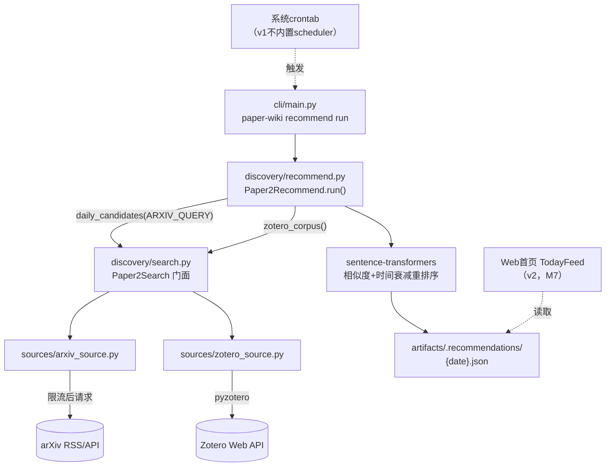
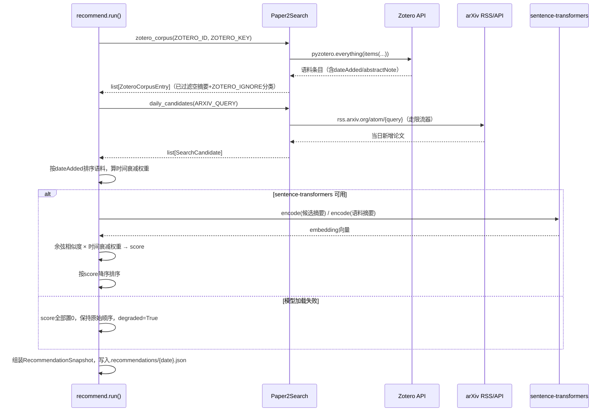
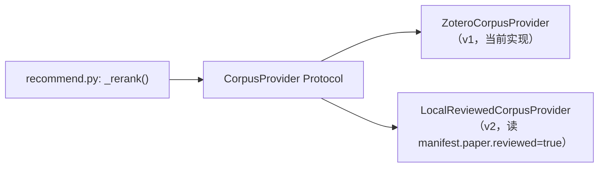

# Paper2Recommend 技术方案

> 状态：已实现（2026-07-14；对应 [Paper-Wiki 需求文档](<./Paper-Wiki%20需求文档.md>) 第3.1节 / 里程碑M5）
> 参考实现：`VibeIDEA/backend/recommender.py` + `VibeIDEA/backend/main.py`
> 关联文档：[Paper2Search 技术方案](<./Paper2Search%20技术方案.md>)（本模块依赖它，不重新实现检索）

---

## 0. 实现摘要（2026-07-14）

当前已新增 `src/paper_wiki/discovery/recommend.py`、`models.py`、`exceptions.py`、`search.py`、`sources/zotero_source.py`，并复用 `sources/arxiv_source.py` 获取候选池。CLI 已提供 `paper-wiki recommend run`；未安装 console script 的开发环境可用 `PYTHONPATH=src python -m paper_wiki.cli.main recommend run ...`。

实现与原设计的主要偏差/补充：

- arXiv 候选仍由 Paper2Search 负责；`daily_candidates()` 优先 RSS，RSS 失败 fallback 到 export API `submittedDate` 查询。
- Zotero ID 做了归一化，兼容纯数字 ID，也兼容 `users/...` / `groups/...` URL 片段；`ZOTERO_LIBRARY_TYPE` 显式区分 user/group。
- 推荐候选池大小由 `RECOMMEND_CANDIDATE_POOL_SIZE` 控制，Top K 由 `MAX_PAPER_NUM` 或 CLI `--max-papers` 控制。
- `sentence-transformers` 不可用时保持 degraded 行为：候选仍落盘，`degraded=True`。

真实验证：`paper-wiki recommend run --max-papers 3` 成功，`corpus_size=192`、`candidate_pool_size=200`、`degraded=False`，写入 `artifacts/.recommendations/2026-07-14.json` 和 `latest.json`。新增 discovery 推荐/Zotero 单元测试，当前 `pytest` 57 passed。

## 1. 背景与调研结论

### 1.1 Paper2Recommend 在整体架构中的定位

Paper2Recommend 是一个**薄封装层**：不直连任何外部 API，只做"调用 Paper2Search 两次 + 重排序"。这是对上一版设计的修正——最初把 Paper2Recommend 设计成独立拉取 arXiv 候选池的模块，与 Paper2Search 的检索能力重复。现在明确：

```
Paper2Recommend = Paper2Search.daily_candidates(ARXIV_QUERY)   ← 候选池
                 × 相似度(Paper2Search.zotero_corpus())         ← 口味语料
                 → Top K
```

Zotero 在这个模型里是"**语料源**"，不是"论文来源"——它不产出会被摄入的论文，只用来算相似度权重。

### 1.2 对 VibeIDEA 的调研结论

读完 `backend/recommender.py`（39行）和 `backend/main.py`（302行）后，提炼出的核心算法与工程细节：

**算法（`recommender.py: rerank_paper`）**：

1. 语料按收藏时间（`dateAdded`）降序排序，算时间衰减权重：`1 / (1 + log10(rank+1))`，归一化后权重和为1——**越新收藏的论文权重越高**，这是让推荐结果跟着"近期兴趣"漂移而不是被历史全部平均掉的关键
2. 用 `sentence-transformers`（默认模型 `avsolatorio/GIST-small-Embedding-v0`）分别 encode 候选论文摘要和语料摘要
3. `sim = encoder.similarity(candidate_feature, corpus_feature)`，得到候选×语料的相似度矩阵
4. `scores = (sim * time_decay_weight).sum(axis=1) * 10`：每个候选对所有语料的加权相似度求和，本质是"这篇候选和我最近关注的方向有多接近"
5. 按 `scores` 降序排序

**工程细节（`main.py`）**：

- Zotero 语料通过 `pyzotero.zotero.Zotero(id, 'user', key).everything(items(itemType=...))` 拉取，过滤掉 `abstractNote` 为空的条目（没摘要没法算相似度）
- 支持按 collection 路径做 gitignore 风格的忽略规则（`ZOTERO_IGNORE`），排除不想影响推荐口味的分类（如"已投稿失败的论文"）
- 候选池优先来自 arXiv 每日新增 RSS（`feedparser.parse(f"https://rss.arxiv.org/atom/{query}")`），只保留 `arxiv_announce_type == 'new'` 的条目（排除更新/交叉列表）；当前 Paper-Wiki 实现补充了 RSS 失败时 fallback 到 export API `submittedDate` 查询
- **模型加载失败时优雅降级**：`try/except` 包住 `SentenceTransformer` 加载，失败时所有候选 `score=0.0`、保持原始顺序，而不是让整个流程崩溃——这一点很重要，因为 `sentence-transformers` 依赖较重（torch），环境问题不该阻断"至少给我一份候选列表"这个基本诉求
- 结果落盘为 `public/recommendations/{latest.json, papers_{date}.json}`，供前端直接读取静态 JSON

### 1.3 与 VibeIDEA 的差异化取舍

| 点                | VibeIDEA 的做法                                                                                                         | Paper2Recommend 的取舍                                                                                                                                                                                                        |
| ----------------- | ----------------------------------------------------------------------------------------------------------------------- | ----------------------------------------------------------------------------------------------------------------------------------------------------------------------------------------------------------------------------- |
| 候选池获取        | `main.py` 自己实现 `get_arxiv_paper()`（`feedparser`+`arxiv.Client`）                                           | **委托给 `Paper2Search.daily_candidates()`**，不重复实现（见1.1）                                                                                                                                                     |
| 每篇候选生成 TLDR | `ArxivPaper.tldr`：下载tarball、抽取introduction/conclusion、调LLM生成一句话摘要，**每篇候选都触发一次LLM调用** | **不做**。候选只用于"要不要勾选"的决策，摘要用arXiv API自带的abstract就够；真正的精读摘要在用户勾选后由 Paper2Insight（`SummaryGenerator`）生成一次，避免同一篇论文被LLM总结两次（一次给候选卡片、一次给正式Summary） |
| 候选去重/落地     | 直接下载全部候选的 tarball 提取图片、上传微信                                                                           | Paper2Recommend 只产出候选**元数据**快照，不下载源码——源码下载是用户勾选后 `Paper2Search.fetch()` 的职责，两件事不在一次运行里做                                                                                    |
| 输出目标          | 邮件 + 微信公众号草稿 + 飞书 + 静态JSON                                                                                 | v1只产出`artifacts/.recommendations/{date}.json` 快照，给 Web 首页读取；不复用VibeIDEA的多渠道推送（那是"发布"范畴，属于Paper2Blog，不属于Paper2Recommend）                                                                 |
| 语料来源          | 只有 Zotero                                                                                                             | v1同Zotero；v2 规划切换/叠加`manifest.paper.reviewed: true` 的本地论文集合，见第7节                                                                                                                                         |

---

## 2. 目标与非目标（v1）

**目标**：

- `run(max_papers=15) -> RecommendationSnapshot`：产出当日候选池快照，写入 `artifacts/.recommendations/{date}.json`
- 相似度重排序算法照搬 VibeIDEA（时间衰减 × embedding余弦相似度）
- `sentence-transformers` 依赖不可用时优雅降级（保留候选，score全为0，不中断流程）
- 候选池获取委托给 `Paper2Search.daily_candidates()`，不重复实现

**明确非目标（v1）**：

- 邮件/飞书/微信的每日推送（VibeIDEA有，但那是Paper2Blog的职责边界，Recommend只负责"算出候选"，"推送出去"是另一件事，v1也不做）
- 语料源切换到本地`reviewed`论文（v2方向，见第7节）
- 定时调度本身（v1提供可被cron调用的CLI命令，不内置scheduler；用系统crontab或后续Web层的定时任务）
- 每候选一次LLM调用生成TLDR（见1.3，刻意不做）

---

## 3. 模块结构

```
src/paper_wiki/discovery/
├── exceptions.py          # Discovery/Recommend 用户可读异常
├── recommend.py            # Paper2Recommend：run() + 相似度计算
├── models.py                # 追加 RecommendationSnapshot / ZoteroCorpusEntry（与search.py共享文件）
├── search.py                # Paper2Search门面，Recommend通过它拿候选池和Zotero语料
└── sources/
    ├── arxiv_source.py      # daily_candidates() 的底层实现，RSS失败fallback到export API
    └── zotero_source.py     # zotero_corpus()：唯一直连Zotero API的地方，属于Paper2Search门面下的一个源
```

`recommend.py` 依赖 `discovery.search`（调用 `daily_candidates()` 和 `zotero_corpus()`），不直接 import `sources/` 下的具体实现——这条边界保证"候选从哪来"的实现细节可以随便改（比如v2多源后 `daily_candidates()` 内部逻辑变化），`recommend.py` 完全无感知。



---

## 4. 数据模型（追加到 `discovery/models.py`）

```python
from __future__ import annotations

from datetime import date, datetime
from pydantic import BaseModel, Field
from paper_wiki.discovery.models import SearchCandidate  # 复用search.py已定义的schema


class ZoteroCorpusEntry(BaseModel):
    """口味语料的一条记录，字段只保留重排序算法需要的部分。"""

    title: str
    abstract: str
    date_added: datetime
    collections: list[str] = Field(default_factory=list)  # 用于ZOTERO_IGNORE过滤


class RankedCandidate(SearchCandidate):
    """SearchCandidate + 推荐得分，score字段在基类里已预留，这里补充理由文本。"""

    reason: str = ""   # 供前端"推荐理由"展示，如"与《XXX》相似度92%"


class RecommendationSnapshot(BaseModel):
    """artifacts/.recommendations/{date}.json 的完整结构。"""

    date: date
    generated_at: datetime
    corpus_size: int              # 本次用了多少条Zotero语料
    candidate_pool_size: int      # 重排序前的候选总数
    candidates: list[RankedCandidate]
    degraded: bool = False        # sentence-transformers不可用时为True，前端可提示"排序未生效"
```

---

## 5. 核心接口

### 5.1 `run(max_papers=15, *, arxiv_query=None, settings=None) -> RecommendationSnapshot`

```python
def run(
    max_papers: int = 15,
    *,
    arxiv_query: str | None = None,   # 默认取 Settings.arxiv_query
    settings: Settings | None = None,
) -> RecommendationSnapshot:
    """
    1. corpus = search.zotero_corpus(settings)          # 口味语料
    2. candidates = search.daily_candidates(query)       # 候选池
    3. ranked = _rerank(candidates, corpus)              # 相似度×时间衰减
    4. snapshot = 组装 RecommendationSnapshot
    5. 落盘 artifacts/.recommendations/{date}.json，同时更新 latest.json（软链接或复制）
    """
```

### 5.2 `_rerank(candidates, corpus) -> list[RankedCandidate]`（照搬VibeIDEA算法）

```python
def _rerank(
    candidates: list[SearchCandidate],
    corpus: list[ZoteroCorpusEntry],
) -> list[RankedCandidate]:
    """
    时间衰减权重：corpus按date_added降序排列后，
        weight[i] = 1 / (1 + log10(i + 1))，归一化到sum=1
    相似度：sentence-transformers encode候选摘要和语料摘要，
        计算余弦相似度矩阵 sim[candidate][corpus_entry]
    最终得分：score = (sim @ weight) * 10
    模型加载失败时：所有候选score=0.0，保持原始顺序，
        RecommendationSnapshot.degraded=True
    """
```

**为什么保留 `*10` 这个缩放常数**：直接照搬 VibeIDEA 的实现，纯粹是为了让 score 落在一个便于阅读的数值区间（0-10左右），不影响排序结果，改不改都行，保留是为了减少和参考实现的差异，方便未来对照调试。

---

## 6. 相似度计算流程



---

## 7. Zotero 语料源（`sources/zotero_source.py`）与 v2 语料切换方向

### v1：外部 Zotero

```python
def zotero_corpus(
    zotero_id: str,
    zotero_key: str,
    *,
    ignore_pattern: str | None = None,
) -> list[ZoteroCorpusEntry]:
    """照搬 VibeIDEA main.py: get_zotero_corpus + filter_corpus：
    - pyzotero拉取collections + items，过滤abstractNote为空的条目
    - 递归拼出每个item所属collection的完整路径
    - ignore_pattern用gitignore语法过滤指定路径下的条目（对应.env的ZOTERO_IGNORE）
    """
```

### v2 方向：语料源可插拔



v2 把 `zotero_corpus()` 的返回值来源抽象成一个 `CorpusProvider` 接口，`_rerank()` 只依赖 `list[ZoteroCorpusEntry]` 这个数据形状，不关心它从 Zotero 来还是从本地 `artifacts/*/manifest.json` 里 `reviewed=true` 的论文摘要来。这样"推荐系统随着使用自我强化、逐步脱离外部Zotero账号依赖"这个产品目标，只需要新增一个 provider 实现，`_rerank()` 和 `run()` 的代码不用改。v1 不预先做这个抽象（YAGNI，只有一个 provider 时接口是纯粹的负担），但数据模型（`ZoteroCorpusEntry` 改名为更通用的 `CorpusEntry` 更合适）设计上已经不依赖 Zotero 特有字段，为v2铺路。

---

## 8. 优雅降级与错误处理

沿用 VibeIDEA 的降级哲学，但用 Paper-Wiki 的异常风格重写：

```python
class RecommendError(RuntimeError):
    """Base class for user-facing recommend failures."""


class ZoteroConfigError(RecommendError):
    """ZOTERO_ID/ZOTERO_KEY 缺失或Zotero API返回鉴权错误。"""
```

- `sentence-transformers`/`torch` 加载失败：**不抛异常**，记录 WARNING，`degraded=True`，候选仍然落盘（保留 arXiv 原始顺序）——这是刻意的产品决策：用户宁愿看到"未排序的今日新增列表"，也不想因为一个可选依赖装环境失败就完全看不到推荐
- `ZOTERO_ID`/`ZOTERO_KEY` 缺失：**抛出** `ZoteroConfigError`，因为没有语料就没法排序，这种情况下"给出一个无意义的候选列表"不如明确报错让用户去配置
- `daily_candidates()` 失败（arXiv API不可用）：向上抛出 `Paper2Search` 的 `ArxivAPIError`，`run()` 不吞掉，因为这是"完全没有候选"的场景，没有优雅降级的余地

---

## 9. 配置项（追加到 `core/config.py: Settings`）

| 字段                          | 环境变量                      | 默认值                                  | 说明                                            |
| ----------------------------- | ----------------------------- | --------------------------------------- | ----------------------------------------------- |
| `zotero_id`                 | `ZOTERO_ID`                 | `None`                                | Zotero用户ID                                    |
| `zotero_key`                | `ZOTERO_KEY`                | `None`                                | Zotero API Key                                  |
| `zotero_library_type`       | `ZOTERO_LIBRARY_TYPE`       | `user`                                | Zotero库类型，支持 `user` / `group`             |
| `zotero_ignore`             | `ZOTERO_IGNORE`             | `None`                                | gitignore风格的collection忽略规则               |
| `arxiv_query`               | `ARXIV_QUERY`               | `cs.AI+cs.LG+cs.CL+cs.IR`             | 候选池的arXiv分类查询                           |
| `max_paper_num`             | `MAX_PAPER_NUM`             | `15`                                  | 推荐Top K数量                                   |
| `recommend_candidate_pool_size` | `RECOMMEND_CANDIDATE_POOL_SIZE` | `200`                            | 拉取后参与排序的候选池大小                      |
| `recommend_embedding_model` | `RECOMMEND_EMBEDDING_MODEL` | `avsolatorio/GIST-small-Embedding-v0` | sentence-transformers模型名，对齐VibeIDEA默认值 |

`sentence-transformers`/`pyzotero`/`feedparser` 作为可选依赖组 `recommend`（见 [Paper-Wiki 需求文档 11.8节](<./Paper-Wiki%20需求文档.md>)），不进核心依赖。

---

## 10. CLI 集成

```bash
paper-wiki recommend run --max-papers 15
```

当前环境尚未安装 console script 时，可用：

```bash
PYTHONPATH=src python -m paper_wiki.cli.main recommend run --max-papers 15
```

配合系统 crontab 实现"每天自动跑一次"：

```bash
# /etc/cron.d/paper-wiki-recommend（示例，不属于代码交付物，部署时按需配置）
0 8 * * * paper-wiki-user cd /path/to/Paper-wiki && paper-wiki recommend run
```

v1 不在应用内置 scheduler（不引入 APScheduler 等新依赖）——crontab 已经能满足"每天固定时间跑一次"的需求，符合"最小垂直切片、克制引入依赖"的原则（呼应需求文档11.8）。

---

## 11. 日志规范

- `run()` 入口/出口各打一条 INFO：`开始生成每日推荐`/`推荐生成完成：candidates=%d, degraded=%s`
- Zotero语料拉取失败打 ERROR（因为会导致 `ZoteroConfigError` 中断流程）
- sentence-transformers加载失败打 WARNING（因为会降级而不是中断），附带具体异常信息方便排查环境问题
- 每次落盘 `artifacts/.recommendations/{date}.json` 后打 INFO 附带文件路径，方便和 Web 层核对是否读到了最新快照

---

## 12. 测试策略

当前 discovery 推荐/Zotero 单元测试已落地，完整测试基线为 `pytest` 57 passed。覆盖内容包括：

- 构造固定的 candidates/corpus fixture，验证时间衰减权重计算和最终排序结果。
- mock `SentenceTransformer` 不可用场景，验证 `degraded=True` 且候选仍然落盘。
- mock Zotero API，测试空摘要过滤、`ZOTERO_IGNORE` 过滤和 Zotero ID 归一化。
- mock `Paper2Search.daily_candidates`/`zotero_corpus`，跑一遍完整 `run()`，验证 `artifacts/.recommendations/{date}.json` 的结构和 `latest.json` 同步更新。

---

## 13. 实施里程碑

对应需求文档里程碑 M5，CLI 与 discovery 包已完成，Web 首页接入仍归 M7：

1. 已完成：`models.py` 追加推荐快照、候选、语料相关模型。
2. 已完成：`sources/zotero_source.py` 的 `zotero_corpus()`（含 ID 归一化与过滤）。
3. 已完成：`recommend.py` 的 `_rerank()` 纯函数。
4. 已完成：`recommend.py` 的 `run()` 编排 + 落盘快照 + 优雅降级。
5. 已完成：`cli/main.py` 新增 `recommend run` 命令。
6. 未完成：（M7，随Web接入）`web/routers/recommendations.py` + 前端 `TodayFeed` 首页。

---

## 14. 参考来源

- `/home/sunzongyuan/projects/VibeIDEA/VibeIDEA/backend/recommender.py`：相似度重排序算法（时间衰减+embedding）
- `/home/sunzongyuan/projects/VibeIDEA/VibeIDEA/backend/main.py`：Zotero语料拉取、arXiv候选拉取、整体编排流程
- `/home/sunzongyuan/projects/VibeIDEA/VibeIDEA/backend/paper.py`：`to_web_dict()`（推荐快照的JSON字段设计参考）
- [Paper2Search 技术方案](<./Paper2Search%20技术方案.md>)：`daily_candidates()`/`zotero_corpus()` 的调用契约
- Paper-Wiki 现有代码：`src/paper_wiki/core/config.py`、`publishing/exceptions.py`、`cli/main.py`
