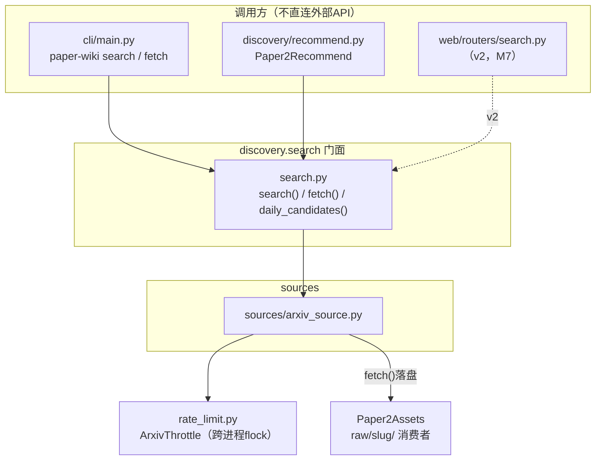
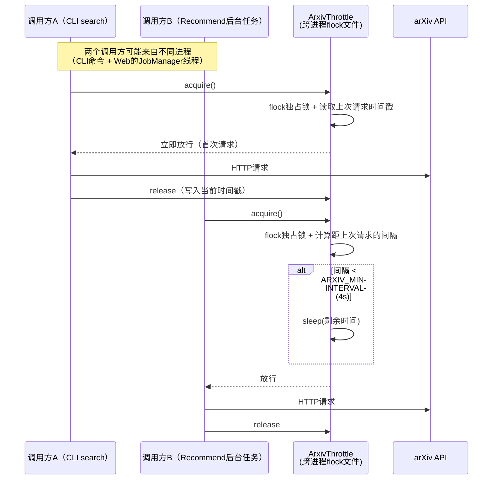
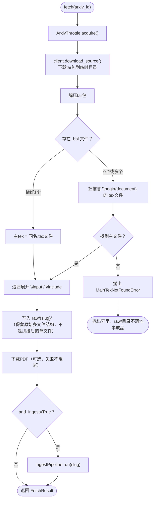

# Paper2Search 技术方案

> 状态：已实现（2026-07-14；对应 [Paper-Wiki 需求文档](<./Paper-Wiki%20需求文档.md>) 第3.1节 / 里程碑M6）
> 参考实现：[Microsoft ResearchStudio `paper_search` skill](https://github.com/microsoft/ResearchStudio/tree/main/ResearchStudio-Idea/skills/paper_search)
> 关联文档：[Paper2Recommend 技术方案](<./Paper2Recommend%20技术方案.md>)（依赖本模块，不重新实现检索）

---

## 0. 实现摘要（2026-07-14）

当前已新增 `src/paper_wiki/discovery/`，Paper2Search 落在 `search.py`、`rate_limit.py`、`exceptions.py`、`models.py` 和 `sources/arxiv_source.py`。CLI 已提供 `paper-wiki search` 与 `paper-wiki fetch`；未安装 console script 的开发环境可用 `PYTHONPATH=src python -m paper_wiki.cli.main ...`。

实现与原设计的主要偏差：

- `search()` 使用 arXiv export API，保持 v1 单源 arXiv。
- `daily_candidates()` 优先 RSS；RSS 失败时 fallback 到 export API 的 `submittedDate` 查询，不让 RSS 可用性阻断推荐。
- `fetch()` 先在临时目录下载源码/PDF并校验主 `.tex`，成功后才落盘到 `raw/{slug}/`。
- 当前实现已保留轻量 `sources/base.py` / `get_source()`，但 `search.py` 门面在 v1 仍直接调用 arXiv 单源；真正的多源注册表遍历和并发调度留到 v2。

真实验证：`search` 已返回候选；`fetch 2406.00552` 成功并可被 `parse` 解析。新增 discovery 单元/集成测试，当前 `pytest` 57 passed。

## 1. 背景与调研结论

### 1.1 Paper2Search 在整体架构中的定位

Paper2Search 是发现层里**唯一直连外部数据源**的模块。Paper2Recommend、Web、CLI 都只消费它暴露的三个函数（`search` / `fetch` / `daily_candidates`），不自己发 HTTP 请求。这条边界的意义：外部数据源的限流、鉴权、schema 差异只在一个地方处理，改一次全局生效。

### 1.2 对 ResearchStudio `paper_search` skill 的调研

仓库结构：`SKILL.md`（agent 使用说明）+ `scripts/`（各数据源 adapter + 一个 orchestrator）+ `references/programmatic_api.md`。读完 `search_papers.py`、`search_papers_by_semantic_scholar.py`、`search_papers_by_arxiv.py`、`_env.py` 后，提炼出以下值得移植的设计：

| 设计点                   | ResearchStudio 的做法                                                                                                                    | 移植到 Paper2Search                                                                        |
| ------------------------ | ---------------------------------------------------------------------------------------------------------------------------------------- | ------------------------------------------------------------------------------------------ |
| 统一 schema              | 每个 adapter 返回`list[dict]`，字段固定为 `title/authors/year/abstract/url/venue/citation_count/publication_date/source`             | 用 Pydantic`SearchCandidate` 替代裸 dict，字段集合基本一致，见第4节                      |
| 数据源注册表             | `_SOURCE_MODULE = {"arxiv": "search_papers_by_arxiv", ...}`，函数名等于模块名，**惰性 import**——某个源缺可选依赖时只影响它自己 | v1 已保留轻量 `sources/base.py` / `get_source()`，门面仍直接调用 arXiv；v2 多源时再扩展为注册表遍历             |
| 并发查询                 | `ThreadPoolExecutor`，每个源的异常在 `_search()` 内被捕获成空列表，不传播到调用方                                                    | v1 暂缓：单源无并发价值；v2 多源时再照搬该模式                                           |
| arXiv 限流礼仪           | 跨进程`fcntl.flock` + 时间戳文件，保证请求间隔 ≥4秒（`ARXIV_MIN_INTERVAL` 可覆盖），多进程并发调用也不超限                          | 完全照搬到`rate_limit.py`，这是本模块**唯一**会触发 arXiv API 的组件，必须限流正确 |
| 可选依赖优雅降级         | OpenReview 需要`openreview-py`，未装时 orchestrator 捕获 `ImportError` 并跳过                                                        | v1 只有 arXiv 一个源，暂时用不上，但注册表结构预留了这个能力给 v2                          |
| model_knowledge 兜底召回 | LLM 用训练记忆补充 API 漏检的论文，标记`(uncertain — verify)`                                                                         | **不引入**，见1.3                                                                    |

### 1.3 与 ResearchStudio 的差异化取舍

ResearchStudio 面向"agent 桌面调用"，输出是给人/LLM 读的 Markdown 表格，一条错误的 `model_knowledge` 记录顶多是读者自己去核实。Paper2Search 的候选一旦被用户勾选，会变成 `raw/{slug}/` 下的真实文件、进而生成知识图谱节点——**编造一篇论文的代价从"读者困惑"变成"污染知识库"**。所以：

- v1 不引入 `model_knowledge` 源
- v1 只接入 arXiv 官方 API（与现有 Paper2Assets 摄入管道的输入格式天然兼容，不需要额外的"候选→raw文件"转换层）
- 多源（Semantic Scholar/OpenAlex/Crossref/DBLP）留到 v2，按同一套注册表模式扩展，接入前需评估各源的元数据可信度

### 1.4 对 VibeIDEA `paper.py` 的调研（`fetch()` 能力的参考实现）

`fetch()`（按 arXiv ID 拉取源码）不是 ResearchStudio 覆盖的场景，参考 VibeIDEA `backend/paper.py: ArxivPaper.tex`：

- 用 `arxiv` 库的 `Result.download_source()` 下载 tarball 到临时目录
- 解压后按 `.bbl` 文件名反推主 tex 文件（`\bibliography` 通常只在主文件里被 `\input`，`.bbl` 文件名与主 tex 同名）；找不到 `.bbl` 或有多个候选时，退化为"找包含 `\begin{document}` 的文件"
- 递归展开 `\input{...}` / `\include{...}`，拼成一份完整正文

这段逻辑直接决定了 Paper2Assets 后续能否正常解析，所以复用而不是重写。

---

## 2. 目标与非目标（v1）

**目标**：

- `search(query, start_year, end_year) -> list[SearchCandidate]`：关键词检索 arXiv，返回统一 schema
- `fetch(arxiv_id) -> FetchResult`：下载 PDF+LaTeX 源码，落盘到 `raw/{slug}/`
- `daily_candidates(category_query) -> list[SearchCandidate]`：内部接口，供 Paper2Recommend 拉候选池
- 全局限流：无论从 CLI、Web、Recommend 哪个入口触发，arXiv 请求间隔都 ≥4秒
- 单元测试可以在不触网的情况下跑（mock HTTP 层）

**明确非目标（v1）**：

- 多源检索（Semantic Scholar/OpenAlex/Crossref/DBLP）——注册表已预留位置，但不实现
- `model_knowledge` LLM 兜底召回
- 检索结果的向量化/语义排序（`search()` 用 arXiv 自带的 relevance 排序，不引入 embedding）
- Web API（`GET /api/search`）——本方案只做 `paper_wiki.discovery.search` 包本身，Web 路由在 discovery 包稳定后接入（对应需求文档里程碑M7）

---

## 3. 模块结构

```
src/paper_wiki/discovery/
├── __init__.py
├── models.py              # SearchCandidate / FetchResult，跨 search.py 和 recommend.py 共享
├── exceptions.py          # DiscoveryError 及子类，风格对齐 publishing/exceptions.py
├── rate_limit.py          # ArxivThrottle：跨进程节流器，从 ResearchStudio 移植
├── sources/
│   ├── __init__.py
│   └── arxiv_source.py     # 唯一实现：search_by_query / daily_candidates / download_source
└── search.py                # Paper2Search 门面：对外只暴露 search() / fetch() / daily_candidates()
```



**依赖方向**：`discovery.search` 依赖 `paper_wiki.core`（Settings、validate_slug）；`paper_wiki.core/assets/ingestion` 不感知 `discovery` 的存在——和 `web` 包遵守的规则完全一致（见需求文档11.1）。`discovery.recommend` 依赖 `discovery.search`，反过来不成立。

---

## 4. 数据模型（`models.py`）

```python
from __future__ import annotations

from datetime import date
from pydantic import BaseModel, Field


class SearchCandidate(BaseModel):
    """统一候选论文 schema，对齐 ResearchStudio 的字段集合，
    并与 core/models.py: PaperMeta、assets/models.py: ReferenceEntry 字段对齐，
    避免 Web/CLI 层重复写一遍字段映射。"""

    title: str
    authors: list[str] = Field(default_factory=list)
    year: int | None = None
    abstract: str = ""
    url: str = ""
    venue: str = ""
    arxiv_id: str = ""
    citation_count: int | None = None
    publication_date: date | None = None
    source: str = "arxiv"          # 目前恒为 "arxiv"，v2多源后区分来源
    score: float | None = None     # 仅 Paper2Recommend 填充，search()/fetch()不使用


class FetchResult(BaseModel):
    """fetch() 的返回：论文源文件已落盘到 raw/{slug}/ 的位置信息。"""

    slug: str
    raw_dir: Path
    entry_file: str            # 相对 raw_dir 的主 tex 文件
    has_pdf: bool
    source_file_count: int
```

---

## 5. 核心接口

### 5.1 `search(query, start_year, end_year, max_results=10) -> list[SearchCandidate]`

```python
def search(
    query: str,
    start_year: int,
    end_year: int,
    max_results: int = 10,
    *,
    settings: Settings | None = None,
) -> list[SearchCandidate]:
    """委托给 sources.arxiv_source.search_by_query，v1只有一个源，
    v2引入注册表遍历时这里改成并发调度多个 SOURCE_REGISTRY 条目。"""
```

v1 实现是"直接调用 arxiv_source"，不提前引入 `ThreadPoolExecutor` 编排——YAGNI：只有一个源时并发调度是无意义的抽象层。v2 加第二个源时，再把这层改造成 ResearchStudio 那种注册表遍历（届时 `search()` 的函数签名不变，只改内部实现，调用方无感知）。

### 5.2 `fetch(arxiv_id, *, and_ingest=False) -> FetchResult`

```python
def fetch(
    arxiv_id: str,
    *,
    and_ingest: bool = False,
    settings: Settings | None = None,
) -> FetchResult:
    """下载PDF+LaTeX源码到 raw/{slug}/；and_ingest=True 时在成功落盘后
    直接调用 IngestPipeline.run(slug) —— 复用现有摄入管道，不重复实现生成逻辑。"""
```

### 5.3 `daily_candidates(category_query, max_results=200) -> list[SearchCandidate]`

内部接口，只被 `discovery.recommend` 调用，不注册 CLI 命令、不暴露 Web 路由。语义是"关键词检索"的特化版本——底层调用同一个 `sources/arxiv_source.py`。当前实现优先走 arXiv 每日新增 RSS（`rss.arxiv.org/atom/{query}`）；RSS 失败时 fallback 到 `export.arxiv.org/api/query` 的 `submittedDate` 查询，因为推荐场景宁可退回 API 候选池，也不应该因 RSS 短暂不可用而完全没有推荐。

---

## 6. 限流与并发设计（`rate_limit.py`，从 ResearchStudio 移植）



**为什么必须跨进程**：Web 的 `JobManager`（`web/services/job_manager.py`）用 `ThreadPoolExecutor` 跑后台任务，Recommend 的定时任务可能是独立进程（cron 触发 `paper-wiki recommend run`），CLI 的 `search`/`fetch` 又是另一个进程。进程内锁（`threading.Lock`）挡不住这些场景同时打 arXiv API，所以照搬 ResearchStudio 用文件锁（`fcntl.flock`）+ 时间戳文件的方案，而不是自己发明一个更复杂的方案。

配置项：`ARXIV_MIN_INTERVAL`（默认4.0秒，对齐 ResearchStudio 默认值）。

---

## 7. `fetch()`：下载与主文件识别（`sources/arxiv_source.py`）



**与 VibeIDEA 的关键差异**：VibeIDEA 的 `paper.py: tex` 把多文件拼成一个 `file_contents["all"]` 字符串直接喂给 LLM 做 TLDR；Paper2Search 的 `fetch()` **不拼接**，而是把原始多文件结构原样写入 `raw/{slug}/`——因为下游 Paper2Assets 的 `LaTeXParser`（`ingestion/latex_parser.py`）已经自己实现了递归内联 `\input`，两边都做一次拼接是重复劳动。`fetch()` 只负责"确保 `raw/{slug}/` 里有一份能被 `LaTeXParser` 正确识别 entry file 的源码"，具体解析交给已有管道。

主文件识别失败时**不写入半成品**到 `raw/{slug}/`——半成品会让用户误以为拉取成功，实际后续 `paper-wiki assets` 会报错，不如在 `fetch()` 阶段就明确失败。

---

## 8. 错误处理（`exceptions.py`）

```python
from __future__ import annotations


class DiscoveryError(RuntimeError):
    """Base class for user-facing discovery/search failures."""


class ArxivAPIError(DiscoveryError):
    """arXiv API 返回错误或超时（含限流429）。"""


class MainTexNotFoundError(DiscoveryError):
    """下载的tarball里找不到可识别的主tex文件，不写入raw/。"""


class SlugAlreadyExistsError(DiscoveryError):
    """raw/{slug}/ 已存在，fetch()默认不覆盖（对齐IngestPipeline的overwrite语义）。"""
```

风格对齐 `publishing/exceptions.py`：都是 `RuntimeError` 子类，语义清晰、不做过度分类。CLI 层捕获 `DiscoveryError` 记录 ERROR 日志后 `typer.Exit(code=1)`，与 `cli/main.py` 现有的 `ingest`/`publish` 命令错误处理模式一致（未来 Web 层同理会映射到 `error_handlers.py` 的 4xx）。

---

## 9. 配置项（追加到 `core/config.py: Settings`）

| 字段                               | 默认值   | 说明                                                |
| ---------------------------------- | -------- | --------------------------------------------------- |
| `arxiv_min_interval`             | `4.0`  | `ARXIV_MIN_INTERVAL`，跨进程节流间隔（秒）        |
| `search_max_results`             | `10`   | `SEARCH_MAX_RESULTS`，`search()` 默认返回条数   |
| `fetch_download_timeout_seconds` | `60.0` | `FETCH_DOWNLOAD_TIMEOUT_SECONDS`，tarball下载超时 |

沿用现有 `pydantic-settings` 模式（`AliasChoices` 支持大小写环境变量），不引入新配置系统。

---

## 10. CLI 集成（`cli/main.py`）

```bash
paper-wiki search "transformer attention mechanism" --start-year 2023 --end-year 2025
paper-wiki fetch 2401.12345
paper-wiki fetch 2401.12345 --and-ingest
```

实现上新增两个 Typer command，风格对齐现有 `parse`/`assets`/`ingest` 命令：`configure_logging(verbose)` 开头，业务逻辑委托给 `discovery.search` 门面函数，捕获 `DiscoveryError` 后 `logger.error` + `typer.Exit(code=1)`，`--verbose` 时改用 `logger.exception` 带堆栈。**CLI 命令函数本身不实现任何检索/下载逻辑**，只做参数解析和错误映射——业务逻辑必须留在 `discovery` 包里，这样 Web 层（M7）接入时直接复用同一套函数，不用把 CLI 里的逻辑再搬一遍。

当前环境尚未安装 console script 时，可用：

```bash
PYTHONPATH=src python -m paper_wiki.cli.main search "transformer attention mechanism"
PYTHONPATH=src python -m paper_wiki.cli.main fetch 2406.00552
```

---

## 11. 日志规范

沿用 `core/logging.py` 的 stdlib logging 风格，`logger = logging.getLogger(__name__)`：

- `search()`/`fetch()` 入口打一条 INFO：`开始检索：query=%s` / `开始拉取：arxiv_id=%s`
- 限流等待时打 DEBUG：`等待arXiv节流：need_wait=%.1fs`（避免高频INFO日志刷屏）
- 数据源失败（v2多源场景）打 WARNING 而不是 ERROR：单个源失败不是致命错误
- `fetch()` 主文件识别失败打 ERROR，附带候选文件列表方便排查

---

## 12. 测试策略

延续 `tests/unit` + `tests/integration` 分层。当前 discovery 单元/集成测试已落地，完整测试基线为 `pytest` 57 passed：

- `tests/unit/test_discovery_rate_limit.py`：验证 `ArxivThrottle` 在同一秒内发起多次 `acquire()` 会阻塞到间隔满足；用可注入的时钟/临时锁文件路径，不依赖真实 sleep 4秒（测试里用极小的 `min_interval` 参数）
- `tests/unit/test_discovery_arxiv_source.py`：mock `arxiv.Client`/`requests`，测试 `.bbl` 匹配主文件的三种分支（0个/1个/多个 `.bbl`）
- `tests/unit/test_discovery_search.py`：mock `sources.arxiv_source`，测 `search()`/`fetch()` 门面函数的参数透传和异常转换
- `tests/integration/test_discovery_fetch_flow.py`：用一个打包好的最小 tarball fixture（不触网），验证"下载→解压→识别主文件→写入raw/"全链路，比照现有 `tests/integration/test_pipeline.py` 的 mock 风格

---

## 13. 实施里程碑

对应需求文档里程碑 M6。CLI 与 discovery 包已完成，Web 接入仍归 M7：

1. 已完成：`models.py` + `exceptions.py` + `rate_limit.py`（可独立单测，不依赖网络）
2. 已完成：`sources/arxiv_source.py` 的 `search_by_query`（用 `export.arxiv.org/api/query`）
3. 已完成：`sources/arxiv_source.py` 的 `download_source` + 主文件识别（临时目录校验后落盘）
4. 已完成：`search.py` 门面 + `daily_candidates()`（供M5的Paper2Recommend调用，含 RSS fallback）
5. 已完成：`cli/main.py` 新增 `search`/`fetch` 命令
6. 未完成：（M7，随Web接入）`web/routers/search.py` + 前端 `SearchAndAdd` 页面

---

## 14. 参考来源

- [Microsoft ResearchStudio - `paper_search` skill](https://github.com/microsoft/ResearchStudio/tree/main/ResearchStudio-Idea/skills/paper_search)：`SKILL.md`、`scripts/search_papers.py`（orchestrator）、`scripts/search_papers_by_arxiv.py`（限流实现）、`scripts/search_papers_by_semantic_scholar.py`（adapter模式样例）、`scripts/_env.py`
- `/home/sunzongyuan/projects/VibeIDEA/VibeIDEA/backend/paper.py`：`ArxivPaper.tex`（tarball下载与主文件识别）
- Paper-Wiki 现有代码：`src/paper_wiki/core/config.py`、`core/validation.py`、`ingestion/latex_parser.py`、`ingestion/pipeline.py`、`publishing/exceptions.py`、`cli/main.py`
